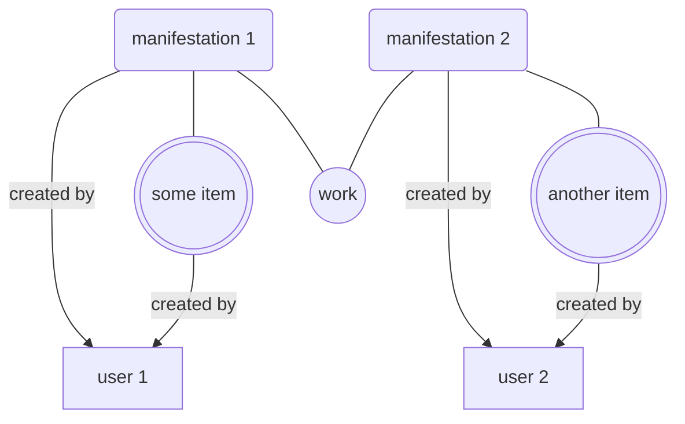
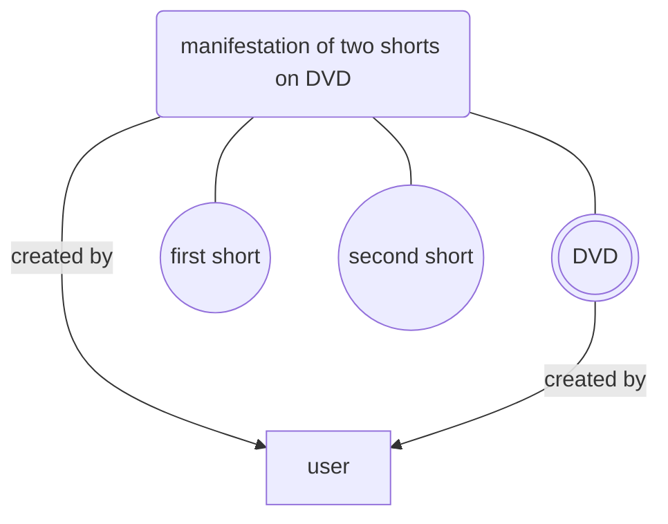

# Schema for Audio-Visual Material

This repository has been created in order to track the development of
schemas and controlled vocabularies for EFI Film Identifiers. The
following EFI types are differentiated and have their own schema,
respectively:

| EFI type:              | work                                                 | manifestation                                      | item                                                   |
|------------------------|------------------------------------------------------|----------------------------------------------------|--------------------------------------------------------|
| Definition:            | [FIAF Cataloguing Manual][fiafmanual] section 1.0.1: | [FIAF Cataloguing Manual][fiafmanual] section 2.0: | [FIAF Cataloguing Manual][fiafmanual] section 3.0:     |
|                        | A moving image Work comprises both the intellectual or artistic content and the process of realisation in a cinematographic medium, e.g., what it is called, when it was made, who made it, who was in it, what it is about, etc. A Work as a conceptual entity is the topmost level of description. [...] It is intended to function as the “node” that relates all Variants and Manifestations of a Work to a common creation. A Work contains the characteristics that are inherited across any Variant, Manifestation, or Item derived from that Work. [...]  | A moving image Manifestation is the embodiment of a moving image Work/Variant. [...] A Manifestation possesses common characteristics with respect to shared intellectual content and physical format, e.g., releases, broadcasts, etc. It may be whole or incomplete or a fragment. A Manifestation is not exclusively bound to a single Work/Variant, since it can be an aggregate for reasons connected to the publication, to the commercial release, or for mere convenience. A Manifestation can therefore be associated or linked to more than one Work/Variant. [...]  | A moving image Item is the physical or digital product of a Manifestation of a Work or Variant, i.e. the actual copy of a Work or Variant. Whereas the Manifestation record describes the “ideal” of a particular format or publication, the Item record represents the actual holding in a repository’s collection. An Item may consist of one or more components, i.e. the whole Item may consist of 1 reel or 5 reels, 2 VHS tapes or 1 DVD. [...] The Item may be whole or incomplete or a fragment. In the case of purely digital media, an Item is defined as the availability of the computer file, irrespective of the number of backup copies that may exist. |
| Accept CREATE if user: | is authenticated and provides metadata or EFI for at least one accompanying manifestation and item.| is authenticated and provides metadata or EFI for at least one accompanying item and work. | is authenticated and provides metadata or EFI for at least one accompanying manifestation and work.  |
| Accept UPDATE if user: | is authenticated and owns at least one manifestation associated with this work.| is authenticated and owns the manifestation.       | is authenticated and owns the item.                    |

[fiafmanual]: https://www.fiafnet.org/pages/E-Resources/Cataloguing-Manual.html

Yet another EFI type "user" represents users known to the system. PIDs
of this type are referenced when recording who has created or updated
any of the EFIs.

### Example 1: Two archives have registered EFIs for the same work

### Example 2: Archive has registered EFIs for a DVD of shorts

