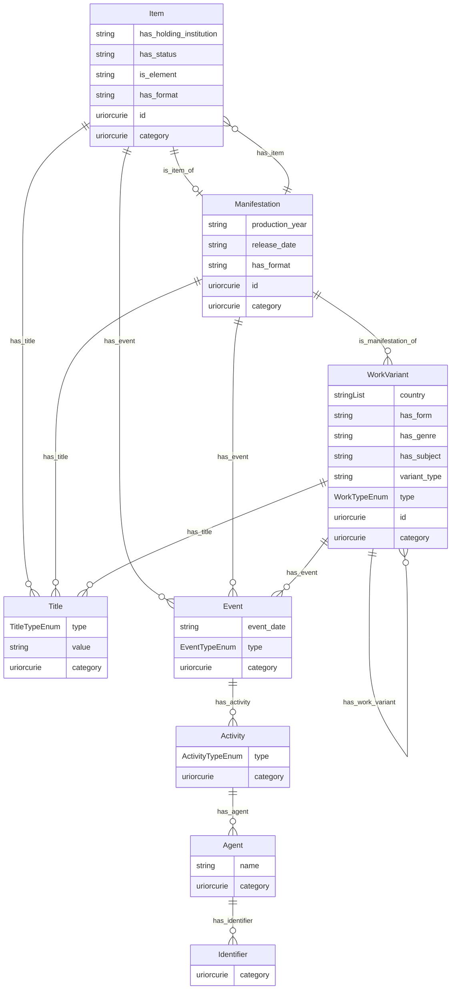

```mermaid
erDiagram
Item {
    string has_holding_institution  
    string has_status  
    string is_element  
    string has_format  
    uriorcurie id  
    uriorcurie category  
}
Title {
    TitleTypeEnum type  
    string value  
    uriorcurie category  
}
Event {
    string event_date  
    EventTypeEnum type  
    uriorcurie category  
}
Activity {
    ActivityTypeEnum type  
    uriorcurie category  
}
Agent {
    string name  
    uriorcurie category  
}
Identifier {
    uriorcurie category  
}
Manifestation {
    string production_year  
    string release_date  
    string has_format  
    uriorcurie id  
    uriorcurie category  
}
WorkVariant {
    stringList country  
    string has_form  
    string has_genre  
    string has_subject  
    string variant_type  
    WorkTypeEnum type  
    uriorcurie id  
    uriorcurie category  
}

Item ||--|o Manifestation : "is_item_of"
Item ||--}o Event : "has_event"
Item ||--}o Title : "has_title"
Event ||--}o Activity : "has_activity"
Activity ||--}o Agent : "has_agent"
Agent ||--}o Identifier : "has_identifier"
Manifestation ||--}o Item : "has_item"
Manifestation ||--}o WorkVariant : "is_manifestation_of"
Manifestation ||--}o Event : "has_event"
Manifestation ||--}o Title : "has_title"
WorkVariant ||--}o WorkVariant : "has_work_variant"
WorkVariant ||--}o Event : "has_event"
WorkVariant ||--}o Title : "has_title"

```

