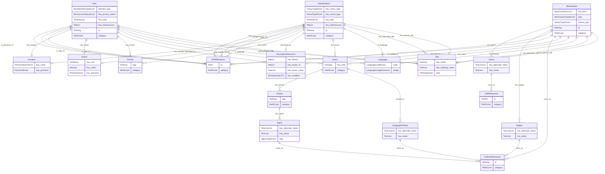

```mermaid
erDiagram
Item {
    ItemElementTypeEnum element_type  
    ItemAccessStatusEnum has_access_status  
    TextAreaList has_note  
    HttpUri has_webresource  
    IDString id  
    AVefiCurie category  
}
Title {
    TextLine has_name  
    TextLine has_ordering_name  
    TitleTypeEnum type  
}
Language {
    LanguageCodeEnum code  
    LanguageUsageEnumList usage  
}
Event {
    ISODate has_date  
    AVefiCurie category  
}
GeographicName {
    TextLineList has_alternate_name  
    TextLine has_name  
}
AuthorityResource {
    IDString id  
    AVefiCurie category  
}
Activity {
    IDString type  
    AVefiCurie category  
}
Agent {
    TextLineList has_alternate_name  
    TextLine has_name  
    AgentTypeEnum type  
}
DescriptionResource {
    HttpUri has_history  
    HttpUri has_issuer_id  
    TextLine has_issuer_name  
    ISODateTimeUTC last_modified  
}
Format {
    IDString type  
    AVefiCurie category  
}
Extent {
    UnitEnum has_unit  
    decimal has_value  
    PrecisionEnum has_precision  
}
Duration {
    ISODurationInHours has_value  
    PrecisionEnum has_precision  
}
AVefiResource {
    AVefi id  
    AVefiCurie category  
}
Manifestation {
    ColourTypeEnum has_colour_type  
    SoundTypeEnum has_sound_type  
    TextAreaList has_note  
    HttpUri has_webresource  
    IDString id  
    AVefiCurie category  
}
WorkVariant {
    WorkFormEnumList has_form  
    WorkVariantTypeEnum type  
    VariantTypeEnum variant_type  
    IDString id  
    AVefiCurie category  
}
Subject {
    TextLineList has_alternate_name  
    TextLine has_name  
}
Genre {
    TextLineList has_alternate_name  
    TextLine has_name  
}
GNDResource {
    GNDID id  
    AVefiCurie category  
}

Item ||--}o AVefiResource : "is_copy_of"
Item ||--}o AVefiResource : "is_derivative_of"
Item ||--|| AVefiResource : "is_item_of"
Item ||--|o Duration : "has_duration"
Item ||--|o Extent : "has_extent"
Item ||--}o Format : "has_format"
Item ||--|o DescriptionResource : "described_by"
Item ||--}o Event : "has_event"
Item ||--}o Language : "in_language"
Item ||--}o Title : "has_alternative_title"
Item ||--|| Title : "has_primary_title"
Event ||--}o Activity : "has_activity"
Event ||--}o GeographicName : "located_in"
GeographicName ||--}o AuthorityResource : "same_as"
Activity ||--}| Agent : "has_agent"
Agent ||--}o AuthorityResource : "same_as"
Manifestation ||--}o AVefiResource : "has_item"
Manifestation ||--}| AVefiResource : "is_manifestation_of"
Manifestation ||--}o AVefiResource : "same_as"
Manifestation ||--|o Duration : "has_duration"
Manifestation ||--|o Extent : "has_extent"
Manifestation ||--}o Format : "has_format"
Manifestation ||--|o DescriptionResource : "described_by"
Manifestation ||--}o Event : "has_event"
Manifestation ||--}o Language : "in_language"
Manifestation ||--}o Title : "has_alternative_title"
Manifestation ||--|| Title : "has_primary_title"
WorkVariant ||--}o Genre : "has_genre"
WorkVariant ||--}o Subject : "has_subject"
WorkVariant ||--}o AVefiResource : "is_part_of"
WorkVariant ||--|o AVefiResource : "is_variant_of"
WorkVariant ||--}o AuthorityResource : "same_as"
WorkVariant ||--|o DescriptionResource : "described_by"
WorkVariant ||--}o Event : "has_event"
WorkVariant ||--}o Language : "in_language"
WorkVariant ||--}o Title : "has_alternative_title"
WorkVariant ||--|| Title : "has_primary_title"
Subject ||--}o AuthorityResource : "same_as"
Genre ||--}o GNDResource : "same_as"

```

