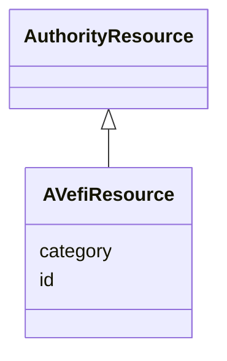

# Class: AVefiResource


_Handle with the prefix allocated for AVefi (eventually)_


URI: [avefi:AVefiResource](https://av-efi.net/schema/av-efi-schema/AVefiResource)





## Inheritance
* [Entity](Entity.md)
    * [AuthorityResource](AuthorityResource.md)
        * **AVefiResource**


## Slots

| Name | Cardinality and Range | Description | Inheritance |
| ---  | --- | --- | --- |
| [id](id.md) | 1..1 <br/> [String](String.md) | A unique identifier for a thing | [AuthorityResource](AuthorityResource.md) |
| [category](category.md) | 1..1 <br/> [Uriorcurie](Uriorcurie.md) |  | [Entity](Entity.md) |


## Usages

| used by | used in | type | used |
| ---  | --- | --- | --- |
| [WorkVariant](WorkVariant.md) | [is_part_of](is_part_of.md) | range | [AVefiResource](AVefiResource.md) |
| [WorkVariant](WorkVariant.md) | [is_variant_of](is_variant_of.md) | range | [AVefiResource](AVefiResource.md) |
| [Manifestation](Manifestation.md) | [has_item](has_item.md) | range | [AVefiResource](AVefiResource.md) |
| [Manifestation](Manifestation.md) | [is_manifestation_of](is_manifestation_of.md) | range | [AVefiResource](AVefiResource.md) |
| [Manifestation](Manifestation.md) | [same_as](same_as.md) | range | [AVefiResource](AVefiResource.md) |
| [Item](Item.md) | [is_copy_of](is_copy_of.md) | range | [AVefiResource](AVefiResource.md) |
| [Item](Item.md) | [is_derivative_of](is_derivative_of.md) | range | [AVefiResource](AVefiResource.md) |
| [Item](Item.md) | [is_item_of](is_item_of.md) | range | [AVefiResource](AVefiResource.md) |


## TODOs

* Possibly change formatter URIs/URLs to the av-efi.net domain when the details have been sorted out

## Identifier and Mapping Information


### Annotations

| property | value |
| --- | --- |
| formatter_uri_for_rdf_resource | https://hdl.handle.net/$1 |


### Schema Source


* from schema: https://av-efi.net/schema/av-efi-schema


## Mappings

| Mapping Type | Mapped Value |
| ---  | ---  |
| self | avefi:AVefiResource |
| native | avefi:AVefiResource |


## LinkML Source

<!-- TODO: investigate https://stackoverflow.com/questions/37606292/how-to-create-tabbed-code-blocks-in-mkdocs-or-sphinx -->

### Direct

<details>
```yaml
name: AVefiResource
annotations:
  formatter_uri_for_rdf_resource:
    tag: formatter_uri_for_rdf_resource
    value: https://hdl.handle.net/$1
description: Handle with the prefix allocated for AVefi (eventually)
todos:
- Possibly change formatter URIs/URLs to the av-efi.net domain when the details have
  been sorted out
from_schema: https://av-efi.net/schema/av-efi-schema
is_a: AuthorityResource
slot_usage:
  id:
    name: id
    domain_of:
    - PIDRecord
    - AuthorityResource
    pattern: ^21(\\.([0-9A-Za-z])+)*\\/([!-~])+$

```
</details>

### Induced

<details>
```yaml
name: AVefiResource
annotations:
  formatter_uri_for_rdf_resource:
    tag: formatter_uri_for_rdf_resource
    value: https://hdl.handle.net/$1
description: Handle with the prefix allocated for AVefi (eventually)
todos:
- Possibly change formatter URIs/URLs to the av-efi.net domain when the details have
  been sorted out
from_schema: https://av-efi.net/schema/av-efi-schema
is_a: AuthorityResource
slot_usage:
  id:
    name: id
    domain_of:
    - PIDRecord
    - AuthorityResource
    pattern: ^21(\\.([0-9A-Za-z])+)*\\/([!-~])+$
attributes:
  id:
    name: id
    description: A unique identifier for a thing
    from_schema: https://av-efi.net/schema/av-efi-schema
    rank: 1000
    slot_uri: schema:identifier
    identifier: true
    alias: id
    owner: AVefiResource
    domain_of:
    - PIDRecord
    - AuthorityResource
    range: string
    required: true
    pattern: ^21(\\.([0-9A-Za-z])+)*\\/([!-~])+$
  category:
    name: category
    from_schema: https://av-efi.net/schema/av-efi-schema
    rank: 1000
    slot_uri: rdf:type
    designates_type: true
    alias: category
    owner: AVefiResource
    domain_of:
    - Entity
    range: uriorcurie
    required: true

```
</details>