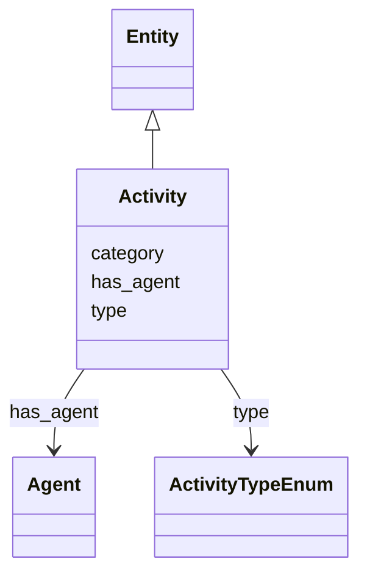

# Class: Activity


_FIAF Moving Image Cataloguing Manual 1.4.1.1_


URI: [avefi:Activity](https://av-efi.net/schema/av-efi-schema/Activity)





## Inheritance
* [Entity](Entity.md)
    * **Activity**


## Slots

| Name | Cardinality and Range | Description | Inheritance |
| ---  | --- | --- | --- |
| [has_agent](has_agent.md) | 1..* <br/> [Agent](Agent.md) | Agent involved in some activity related to the moving image resource | direct |
| [type](type.md) | 1..1 <br/> [ActivityTypeEnum](ActivityTypeEnum.md) |  | direct |
| [category](category.md) | 1..1 <br/> [Uriorcurie](Uriorcurie.md) |  | [Entity](Entity.md) |


## Usages

| used by | used in | type | used |
| ---  | --- | --- | --- |
| [Event](Event.md) | [has_activity](has_activity.md) | range | [Activity](Activity.md) |


## Identifier and Mapping Information


### Schema Source


* from schema: https://av-efi.net/schema/av-efi-schema


## Mappings

| Mapping Type | Mapped Value |
| ---  | ---  |
| self | avefi:Activity |
| native | avefi:Activity |


## LinkML Source

<!-- TODO: investigate https://stackoverflow.com/questions/37606292/how-to-create-tabbed-code-blocks-in-mkdocs-or-sphinx -->

### Direct

<details>
```yaml
name: Activity
description: FIAF Moving Image Cataloguing Manual 1.4.1.1
from_schema: https://av-efi.net/schema/av-efi-schema
is_a: Entity
slots:
- has_agent
- type
slot_usage:
  type:
    name: type
    domain_of:
    - WorkVariant
    - Activity
    - Agent
    - Event
    - Title
    - Format
    - Manifestation
    range: ActivityTypeEnum
    required: true

```
</details>

### Induced

<details>
```yaml
name: Activity
description: FIAF Moving Image Cataloguing Manual 1.4.1.1
from_schema: https://av-efi.net/schema/av-efi-schema
is_a: Entity
slot_usage:
  type:
    name: type
    domain_of:
    - WorkVariant
    - Activity
    - Agent
    - Event
    - Title
    - Format
    - Manifestation
    range: ActivityTypeEnum
    required: true
attributes:
  has_agent:
    name: has_agent
    description: Agent involved in some activity related to the moving image resource
    from_schema: https://av-efi.net/schema/av-efi-schema
    rank: 1000
    multivalued: true
    alias: has_agent
    owner: Activity
    domain_of:
    - Activity
    range: Agent
    required: true
    inlined: true
    inlined_as_list: true
  type:
    name: type
    from_schema: https://av-efi.net/schema/av-efi-schema
    rank: 1000
    alias: type
    owner: Activity
    domain_of:
    - WorkVariant
    - Activity
    - Agent
    - Event
    - Title
    - Format
    - Manifestation
    range: ActivityTypeEnum
    required: true
  category:
    name: category
    from_schema: https://av-efi.net/schema/av-efi-schema
    rank: 1000
    slot_uri: rdf:type
    designates_type: true
    alias: category
    owner: Activity
    domain_of:
    - Entity
    range: uriorcurie
    required: true

```
</details>