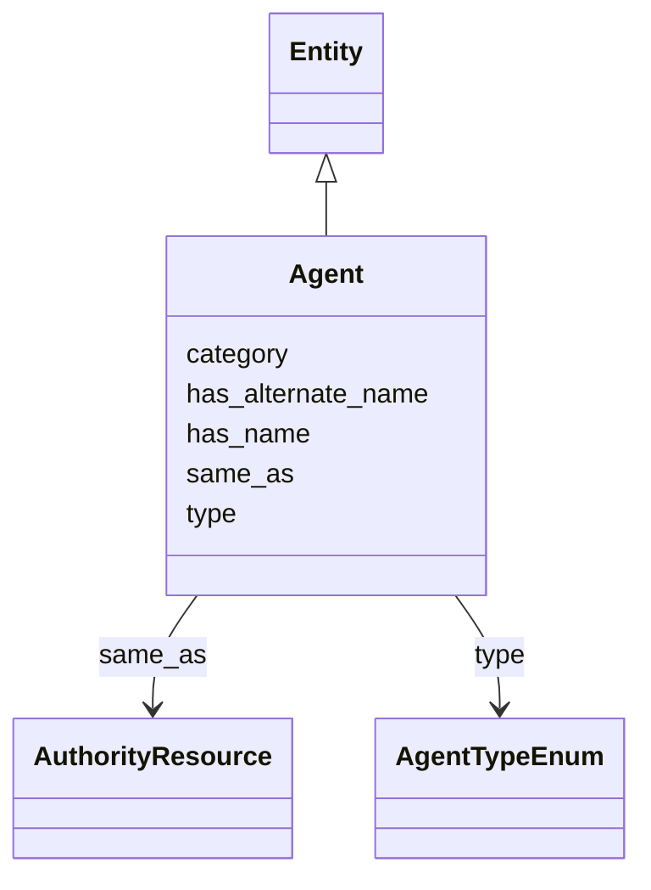

# Class: Agent


_Agent involved in some activity related to the moving image resource. For agents of type "Person" specify name according to the convention "family name, given name"_


URI: [avefi:Agent](https://av-efi.net/schema/av-efi-schema/Agent)





## Inheritance
* [Entity](Entity.md)
    * **Agent**


## Slots

| Name | Cardinality and Range | Description | Inheritance |
| ---  | --- | --- | --- |
| [has_alternate_name](has_alternate_name.md) | 0..* <br/> [String](String.md) |  | direct |
| [has_name](has_name.md) | 1..1 <br/> [String](String.md) | For natural persons, always use the convention "family name, given name" | direct |
| [same_as](same_as.md) | 0..* <br/> [AuthorityResource](AuthorityResource.md) |  | direct |
| [type](type.md) | 1..1 <br/> [AgentTypeEnum](AgentTypeEnum.md) |  | direct |
| [category](category.md) | 1..1 <br/> [Uriorcurie](Uriorcurie.md) |  | [Entity](Entity.md) |


## Usages

| used by | used in | type | used |
| ---  | --- | --- | --- |
| [Activity](Activity.md) | [has_agent](has_agent.md) | range | [Agent](Agent.md) |


## Identifier and Mapping Information


### Schema Source


* from schema: https://av-efi.net/schema/av-efi-schema


## Mappings

| Mapping Type | Mapped Value |
| ---  | ---  |
| self | avefi:Agent |
| native | avefi:Agent |
| related | fiaf:Agent, foaf:Agent |


## LinkML Source

<!-- TODO: investigate https://stackoverflow.com/questions/37606292/how-to-create-tabbed-code-blocks-in-mkdocs-or-sphinx -->

### Direct

<details>
```yaml
name: Agent
description: Agent involved in some activity related to the moving image resource.
  For agents of type "Person" specify name according to the convention "family name,
  given name"
from_schema: https://av-efi.net/schema/av-efi-schema
related_mappings:
- fiaf:Agent
- foaf:Agent
is_a: Entity
slots:
- has_alternate_name
- has_name
- same_as
- type
slot_usage:
  has_name:
    name: has_name
    description: For natural persons, always use the convention "family name, given
      name"
    domain_of:
    - GeographicName
    - Genre
    - Subject
    - Agent
    - Title
  type:
    name: type
    domain_of:
    - WorkVariant
    - Activity
    - Agent
    - Event
    - Title
    - Format
    - Manifestation
    range: AgentTypeEnum
    required: true

```
</details>

### Induced

<details>
```yaml
name: Agent
description: Agent involved in some activity related to the moving image resource.
  For agents of type "Person" specify name according to the convention "family name,
  given name"
from_schema: https://av-efi.net/schema/av-efi-schema
related_mappings:
- fiaf:Agent
- foaf:Agent
is_a: Entity
slot_usage:
  has_name:
    name: has_name
    description: For natural persons, always use the convention "family name, given
      name"
    domain_of:
    - GeographicName
    - Genre
    - Subject
    - Agent
    - Title
  type:
    name: type
    domain_of:
    - WorkVariant
    - Activity
    - Agent
    - Event
    - Title
    - Format
    - Manifestation
    range: AgentTypeEnum
    required: true
attributes:
  has_alternate_name:
    name: has_alternate_name
    from_schema: https://av-efi.net/schema/av-efi-schema
    rank: 1000
    slot_uri: schema:alternateName
    multivalued: true
    alias: has_alternate_name
    owner: Agent
    domain_of:
    - GeographicName
    - Genre
    - Subject
    - Agent
    range: string
  has_name:
    name: has_name
    description: For natural persons, always use the convention "family name, given
      name"
    from_schema: https://av-efi.net/schema/av-efi-schema
    rank: 1000
    slot_uri: schema:name
    alias: has_name
    owner: Agent
    domain_of:
    - GeographicName
    - Genre
    - Subject
    - Agent
    - Title
    range: string
    required: true
  same_as:
    name: same_as
    from_schema: https://av-efi.net/schema/av-efi-schema
    rank: 1000
    multivalued: true
    alias: same_as
    owner: Agent
    domain_of:
    - WorkVariant
    - GeographicName
    - Genre
    - Subject
    - Agent
    - Manifestation
    range: AuthorityResource
    inlined: true
    inlined_as_list: true
  type:
    name: type
    from_schema: https://av-efi.net/schema/av-efi-schema
    rank: 1000
    alias: type
    owner: Agent
    domain_of:
    - WorkVariant
    - Activity
    - Agent
    - Event
    - Title
    - Format
    - Manifestation
    range: AgentTypeEnum
    required: true
  category:
    name: category
    from_schema: https://av-efi.net/schema/av-efi-schema
    rank: 1000
    slot_uri: rdf:type
    designates_type: true
    alias: category
    owner: Agent
    domain_of:
    - Entity
    range: uriorcurie
    required: true

```
</details>