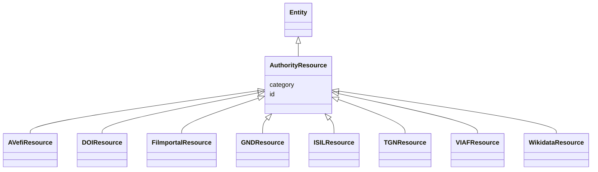

# Class: AuthorityResource


_Root class for all identifiers from some kind of authority or public register widely accepted in the community_


* __NOTE__: this is an abstract class and should not be instantiated directly


URI: [avefi:AuthorityResource](https://av-efi.net/schema/av-efi-schema/AuthorityResource)





## Inheritance
* [Entity](Entity.md)
    * **AuthorityResource**
        * [AVefiResource](AVefiResource.md)
        * [DOIResource](DOIResource.md)
        * [FilmportalResource](FilmportalResource.md)
        * [GNDResource](GNDResource.md)
        * [ISILResource](ISILResource.md)
        * [TGNResource](TGNResource.md)
        * [VIAFResource](VIAFResource.md)
        * [WikidataResource](WikidataResource.md)


## Slots

| Name | Cardinality and Range | Description | Inheritance |
| ---  | --- | --- | --- |
| [id](id.md) | 1..1 <br/> [String](String.md) | A unique identifier for a thing | direct |
| [category](category.md) | 1..1 <br/> [Uriorcurie](Uriorcurie.md) |  | [Entity](Entity.md) |


## Usages

| used by | used in | type | used |
| ---  | --- | --- | --- |
| [WorkVariant](WorkVariant.md) | [same_as](same_as.md) | range | [AuthorityResource](AuthorityResource.md) |
| [GeographicName](GeographicName.md) | [same_as](same_as.md) | range | [AuthorityResource](AuthorityResource.md) |
| [Subject](Subject.md) | [same_as](same_as.md) | range | [AuthorityResource](AuthorityResource.md) |
| [Agent](Agent.md) | [same_as](same_as.md) | range | [AuthorityResource](AuthorityResource.md) |


## Identifier and Mapping Information


### Schema Source


* from schema: https://av-efi.net/schema/av-efi-schema


## Mappings

| Mapping Type | Mapped Value |
| ---  | ---  |
| self | avefi:AuthorityResource |
| native | avefi:AuthorityResource |


## LinkML Source

<!-- TODO: investigate https://stackoverflow.com/questions/37606292/how-to-create-tabbed-code-blocks-in-mkdocs-or-sphinx -->

### Direct

<details>
```yaml
name: AuthorityResource
description: Root class for all identifiers from some kind of authority or public
  register widely accepted in the community
from_schema: https://av-efi.net/schema/av-efi-schema
is_a: Entity
abstract: true
slots:
- id
slot_usage:
  id:
    name: id
    domain_of:
    - PIDRecord
    - AuthorityResource
    range: string

```
</details>

### Induced

<details>
```yaml
name: AuthorityResource
description: Root class for all identifiers from some kind of authority or public
  register widely accepted in the community
from_schema: https://av-efi.net/schema/av-efi-schema
is_a: Entity
abstract: true
slot_usage:
  id:
    name: id
    domain_of:
    - PIDRecord
    - AuthorityResource
    range: string
attributes:
  id:
    name: id
    description: A unique identifier for a thing
    from_schema: https://av-efi.net/schema/av-efi-schema
    rank: 1000
    slot_uri: schema:identifier
    identifier: true
    alias: id
    owner: AuthorityResource
    domain_of:
    - PIDRecord
    - AuthorityResource
    range: string
    required: true
  category:
    name: category
    from_schema: https://av-efi.net/schema/av-efi-schema
    rank: 1000
    slot_uri: rdf:type
    designates_type: true
    alias: category
    owner: AuthorityResource
    domain_of:
    - Entity
    range: uriorcurie
    required: true

```
</details>