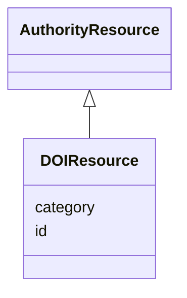

# Class: DOIResource


_Digital Object Identifier maintained by the DOI Foundation and commonly used for scientific publications including films._


URI: [avefi:DOIResource](https://av-efi.net/schema/av-efi-schema/DOIResource)





## Inheritance
* [Entity](Entity.md)
    * [AuthorityResource](AuthorityResource.md)
        * **DOIResource**


## Slots

| Name | Cardinality and Range | Description | Inheritance |
| ---  | --- | --- | --- |
| [id](id.md) | 1..1 <br/> [String](String.md) | A unique identifier for a thing | [AuthorityResource](AuthorityResource.md) |
| [category](category.md) | 1..1 <br/> [Uriorcurie](Uriorcurie.md) |  | [Entity](Entity.md) |


## See Also

* [https://dx.doi.org/](https://dx.doi.org/)
* [https://www.wikidata.org/wiki/Property:P356](https://www.wikidata.org/wiki/Property:P356)

## Identifier and Mapping Information


### Annotations

| property | value |
| --- | --- |
| formatter_uri_for_rdf_resource | http://dx.doi.org/$1 || formatter_url_for_web_resource | https://dx.doi.org/$1 || provides | ['CreativeWorkIdentifier'] |


### Schema Source


* from schema: https://av-efi.net/schema/av-efi-schema


## Mappings

| Mapping Type | Mapped Value |
| ---  | ---  |
| self | avefi:DOIResource |
| native | avefi:DOIResource |


## LinkML Source

<!-- TODO: investigate https://stackoverflow.com/questions/37606292/how-to-create-tabbed-code-blocks-in-mkdocs-or-sphinx -->

### Direct

<details>
```yaml
name: DOIResource
annotations:
  formatter_uri_for_rdf_resource:
    tag: formatter_uri_for_rdf_resource
    value: http://dx.doi.org/$1
  formatter_url_for_web_resource:
    tag: formatter_url_for_web_resource
    value: https://dx.doi.org/$1
  provides:
    tag: provides
    value:
    - CreativeWorkIdentifier
description: Digital Object Identifier maintained by the DOI Foundation and commonly
  used for scientific publications including films.
from_schema: https://av-efi.net/schema/av-efi-schema
see_also:
- https://dx.doi.org/
- https://www.wikidata.org/wiki/Property:P356
is_a: AuthorityResource
slot_usage:
  id:
    name: id
    domain_of:
    - PIDRecord
    - AuthorityResource
    pattern: ^10\\.[0-9]{4,9}(\\.[0-9]+)*(\\/|%2F)((?![\"&\'])\\S)+$

```
</details>

### Induced

<details>
```yaml
name: DOIResource
annotations:
  formatter_uri_for_rdf_resource:
    tag: formatter_uri_for_rdf_resource
    value: http://dx.doi.org/$1
  formatter_url_for_web_resource:
    tag: formatter_url_for_web_resource
    value: https://dx.doi.org/$1
  provides:
    tag: provides
    value:
    - CreativeWorkIdentifier
description: Digital Object Identifier maintained by the DOI Foundation and commonly
  used for scientific publications including films.
from_schema: https://av-efi.net/schema/av-efi-schema
see_also:
- https://dx.doi.org/
- https://www.wikidata.org/wiki/Property:P356
is_a: AuthorityResource
slot_usage:
  id:
    name: id
    domain_of:
    - PIDRecord
    - AuthorityResource
    pattern: ^10\\.[0-9]{4,9}(\\.[0-9]+)*(\\/|%2F)((?![\"&\'])\\S)+$
attributes:
  id:
    name: id
    description: A unique identifier for a thing
    from_schema: https://av-efi.net/schema/av-efi-schema
    rank: 1000
    slot_uri: schema:identifier
    identifier: true
    alias: id
    owner: DOIResource
    domain_of:
    - PIDRecord
    - AuthorityResource
    range: string
    required: true
    pattern: ^10\\.[0-9]{4,9}(\\.[0-9]+)*(\\/|%2F)((?![\"&\'])\\S)+$
  category:
    name: category
    from_schema: https://av-efi.net/schema/av-efi-schema
    rank: 1000
    slot_uri: rdf:type
    designates_type: true
    alias: category
    owner: DOIResource
    domain_of:
    - Entity
    range: uriorcurie
    required: true

```
</details>