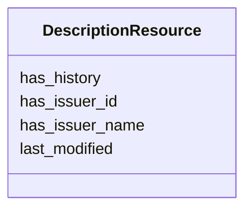

# Class: DescriptionResource


_Metadata about the PID rather than the identified object, i.e. who modified the PID metadata record when, making what changes_


URI: [avefi:DescriptionResource](https://av-efi.net/schema/av-efi-schema/DescriptionResource)





<!-- no inheritance hierarchy -->


## Slots

| Name | Cardinality and Range | Description | Inheritance |
| ---  | --- | --- | --- |
| [has_history](has_history.md) | 0..1 <br/> [Uri](Uri.md) | Link to revision history of this PID | direct |
| [has_issuer_id](has_issuer_id.md) | 1..1 <br/> [Uri](Uri.md) | Identifier for the responsible party as an URI suitable for linked data | direct |
| [has_issuer_name](has_issuer_name.md) | 1..1 <br/> [String](String.md) | Name of the responsible party | direct |
| [last_modified](last_modified.md) | 1..1 <br/> [Datetime](Datetime.md) | Timestamp (in UTC) for the latest modification to any field in the PID metada... | direct |


## Usages

| used by | used in | type | used |
| ---  | --- | --- | --- |
| [MovingImageRecord](MovingImageRecord.md) | [described_by](described_by.md) | range | [DescriptionResource](DescriptionResource.md) |
| [WorkVariant](WorkVariant.md) | [described_by](described_by.md) | range | [DescriptionResource](DescriptionResource.md) |
| [ManifestationOrItem](ManifestationOrItem.md) | [described_by](described_by.md) | range | [DescriptionResource](DescriptionResource.md) |
| [Manifestation](Manifestation.md) | [described_by](described_by.md) | range | [DescriptionResource](DescriptionResource.md) |
| [Item](Item.md) | [described_by](described_by.md) | range | [DescriptionResource](DescriptionResource.md) |


## Identifier and Mapping Information


### Schema Source


* from schema: https://av-efi.net/schema/av-efi-schema


## Mappings

| Mapping Type | Mapped Value |
| ---  | ---  |
| self | avefi:DescriptionResource |
| native | avefi:DescriptionResource |


## LinkML Source

<!-- TODO: investigate https://stackoverflow.com/questions/37606292/how-to-create-tabbed-code-blocks-in-mkdocs-or-sphinx -->

### Direct

<details>
```yaml
name: DescriptionResource
description: Metadata about the PID rather than the identified object, i.e. who modified
  the PID metadata record when, making what changes
from_schema: https://av-efi.net/schema/av-efi-schema
slots:
- has_history
- has_issuer_id
- has_issuer_name
- last_modified

```
</details>

### Induced

<details>
```yaml
name: DescriptionResource
description: Metadata about the PID rather than the identified object, i.e. who modified
  the PID metadata record when, making what changes
from_schema: https://av-efi.net/schema/av-efi-schema
attributes:
  has_history:
    name: has_history
    description: Link to revision history of this PID
    from_schema: https://av-efi.net/schema/av-efi-schema
    rank: 1000
    alias: has_history
    owner: DescriptionResource
    domain_of:
    - DescriptionResource
    range: uri
  has_issuer_id:
    name: has_issuer_id
    description: Identifier for the responsible party as an URI suitable for linked
      data
    examples:
    - value: https://ld.zdb-services.de/resource/organisations/DE-MUS-432511
      description: ISIL of the Filmmuseum Düsseldorf
    from_schema: https://av-efi.net/schema/av-efi-schema
    rank: 1000
    slot_uri: wdrs:issuedby
    alias: has_issuer_id
    owner: DescriptionResource
    domain_of:
    - DescriptionResource
    range: uri
    required: true
  has_issuer_name:
    name: has_issuer_name
    description: Name of the responsible party
    examples:
    - value: Filmmuseum Düsseldorf
      description: Human readable name of the issuer
    from_schema: https://av-efi.net/schema/av-efi-schema
    rank: 1000
    slot_uri: dcterms:contributor
    alias: has_issuer_name
    owner: DescriptionResource
    domain_of:
    - DescriptionResource
    range: string
    required: true
  last_modified:
    name: last_modified
    description: Timestamp (in UTC) for the latest modification to any field in the
      PID metadata record
    from_schema: https://av-efi.net/schema/av-efi-schema
    rank: 1000
    slot_uri: dcterms:modified
    alias: last_modified
    owner: DescriptionResource
    domain_of:
    - DescriptionResource
    range: datetime
    required: true
    pattern: ^2[0-9]{3}-(0[1-9]|1[0-2])-(0[1-9]|[12][0-9]|3[01])T([0-1][0-9]|2[0-3]):[0-5][0-9]:([0-5][0-9]|60)(\.[0-9]+)?Z$

```
</details>