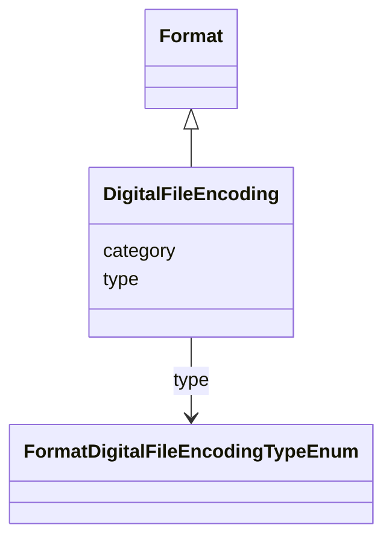

# Class: DigitalFileEncoding


_FIAF Moving Image Cataloguing Manual D.7.2_


URI: [avefi:DigitalFileEncoding](https://av-efi.net/schema/av-efi-schema/DigitalFileEncoding)





## Inheritance
* [Entity](Entity.md)
    * [Format](Format.md)
        * **DigitalFileEncoding**


## Slots

| Name | Cardinality and Range | Description | Inheritance |
| ---  | --- | --- | --- |
| [type](type.md) | 0..1 <br/> [FormatDigitalFileEncodingTypeEnum](FormatDigitalFileEncodingTypeEnum.md) |  | [Format](Format.md) |
| [category](category.md) | 1..1 <br/> [Uriorcurie](Uriorcurie.md) |  | [Entity](Entity.md) |


## Identifier and Mapping Information


### Schema Source


* from schema: https://av-efi.net/schema/av-efi-schema


## Mappings

| Mapping Type | Mapped Value |
| ---  | ---  |
| self | avefi:DigitalFileEncoding |
| native | avefi:DigitalFileEncoding |
| close | fiaf:DigitalFileEncoding |


## LinkML Source

<!-- TODO: investigate https://stackoverflow.com/questions/37606292/how-to-create-tabbed-code-blocks-in-mkdocs-or-sphinx -->

### Direct

<details>
```yaml
name: DigitalFileEncoding
description: FIAF Moving Image Cataloguing Manual D.7.2
from_schema: https://av-efi.net/schema/av-efi-schema
close_mappings:
- fiaf:DigitalFileEncoding
is_a: Format
slot_usage:
  type:
    name: type
    domain_of:
    - WorkVariant
    - Activity
    - Agent
    - Event
    - Title
    - Format
    - Manifestation
    range: FormatDigitalFileEncodingTypeEnum

```
</details>

### Induced

<details>
```yaml
name: DigitalFileEncoding
description: FIAF Moving Image Cataloguing Manual D.7.2
from_schema: https://av-efi.net/schema/av-efi-schema
close_mappings:
- fiaf:DigitalFileEncoding
is_a: Format
slot_usage:
  type:
    name: type
    domain_of:
    - WorkVariant
    - Activity
    - Agent
    - Event
    - Title
    - Format
    - Manifestation
    range: FormatDigitalFileEncodingTypeEnum
attributes:
  type:
    name: type
    from_schema: https://av-efi.net/schema/av-efi-schema
    rank: 1000
    alias: type
    owner: DigitalFileEncoding
    domain_of:
    - WorkVariant
    - Activity
    - Agent
    - Event
    - Title
    - Format
    - Manifestation
    range: FormatDigitalFileEncodingTypeEnum
  category:
    name: category
    from_schema: https://av-efi.net/schema/av-efi-schema
    rank: 1000
    slot_uri: rdf:type
    designates_type: true
    alias: category
    owner: DigitalFileEncoding
    domain_of:
    - Entity
    range: uriorcurie
    required: true

```
</details>