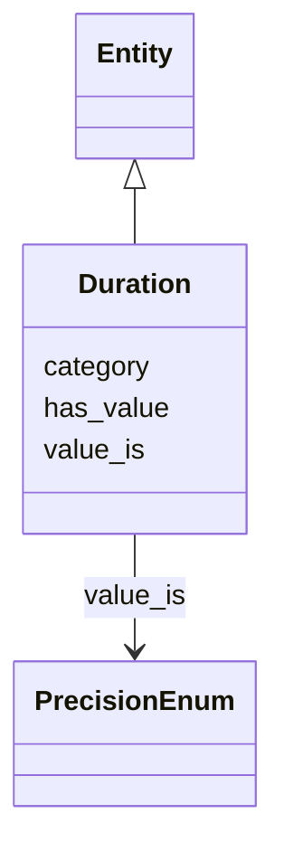

# Class: Duration


_Total running time of the described object in ISO 8601 duration format. The examples section lists possible values for the has_value slot. See also: FIAF Moving Image Cataloguing Manual 2.3.5.3, 3.1.5.11_


URI: [avefi:Duration](https://av-efi.net/schema/av-efi-schema/Duration)





## Inheritance
* [Entity](Entity.md)
    * **Duration**


## Slots

| Name | Cardinality and Range | Description | Inheritance |
| ---  | --- | --- | --- |
| [has_value](has_value.md) | 0..1 <br/> [String](String.md) | Value of some quantity | direct |
| [value_is](value_is.md) | 0..1 <br/> [PrecisionEnum](PrecisionEnum.md) | Qualifier indicating the precision of an extent value or duration | direct |
| [category](category.md) | 1..1 <br/> [Uriorcurie](Uriorcurie.md) |  | [Entity](Entity.md) |


## Usages

| used by | used in | type | used |
| ---  | --- | --- | --- |
| [ManifestationOrItem](ManifestationOrItem.md) | [has_duration](has_duration.md) | range | [Duration](Duration.md) |
| [Manifestation](Manifestation.md) | [has_duration](has_duration.md) | range | [Duration](Duration.md) |
| [Item](Item.md) | [has_duration](has_duration.md) | range | [Duration](Duration.md) |


## Examples

| Value |
| --- |
| PT3H18M45S |
| PT2H9M |
| PT6M12S |

## Identifier and Mapping Information


### Schema Source


* from schema: https://av-efi.net/schema/av-efi-schema


## Mappings

| Mapping Type | Mapped Value |
| ---  | ---  |
| self | avefi:Duration |
| native | avefi:Duration |


## LinkML Source

<!-- TODO: investigate https://stackoverflow.com/questions/37606292/how-to-create-tabbed-code-blocks-in-mkdocs-or-sphinx -->

### Direct

<details>
```yaml
name: Duration
description: 'Total running time of the described object in ISO 8601 duration format.
  The examples section lists possible values for the has_value slot. See also: FIAF
  Moving Image Cataloguing Manual 2.3.5.3, 3.1.5.11'
notes:
- https://www.w3.org/TR/xmlschema11-2/#duration
examples:
- value: PT3H18M45S
  description: 3 hours, 18 minutes, 45 seconds
- value: PT2H9M
  description: 2 hours, 9 minutes
- value: PT6M12S
  description: 6 minutes, 12 seconds
from_schema: https://av-efi.net/schema/av-efi-schema
is_a: Entity
slots:
- has_value
- value_is
slot_usage:
  has_value:
    name: has_value
    domain_of:
    - Duration
    - Extent
    range: string
    pattern: ^PT(([1-9][0-9]*H)?(([1-5][0-9]|[1-9])M)?([1-5][0-9]|[1-9])S|([1-9][0-9]*H)?([1-5][0-9]|[1-9])M|[1-9][0-9]*H)$

```
</details>

### Induced

<details>
```yaml
name: Duration
description: 'Total running time of the described object in ISO 8601 duration format.
  The examples section lists possible values for the has_value slot. See also: FIAF
  Moving Image Cataloguing Manual 2.3.5.3, 3.1.5.11'
notes:
- https://www.w3.org/TR/xmlschema11-2/#duration
examples:
- value: PT3H18M45S
  description: 3 hours, 18 minutes, 45 seconds
- value: PT2H9M
  description: 2 hours, 9 minutes
- value: PT6M12S
  description: 6 minutes, 12 seconds
from_schema: https://av-efi.net/schema/av-efi-schema
is_a: Entity
slot_usage:
  has_value:
    name: has_value
    domain_of:
    - Duration
    - Extent
    range: string
    pattern: ^PT(([1-9][0-9]*H)?(([1-5][0-9]|[1-9])M)?([1-5][0-9]|[1-9])S|([1-9][0-9]*H)?([1-5][0-9]|[1-9])M|[1-9][0-9]*H)$
attributes:
  has_value:
    name: has_value
    description: Value of some quantity
    from_schema: https://av-efi.net/schema/av-efi-schema
    rank: 1000
    alias: has_value
    owner: Duration
    domain_of:
    - Duration
    - Extent
    range: string
    pattern: ^PT(([1-9][0-9]*H)?(([1-5][0-9]|[1-9])M)?([1-5][0-9]|[1-9])S|([1-9][0-9]*H)?([1-5][0-9]|[1-9])M|[1-9][0-9]*H)$
  value_is:
    name: value_is
    description: Qualifier indicating the precision of an extent value or duration
    from_schema: https://av-efi.net/schema/av-efi-schema
    rank: 1000
    alias: value_is
    owner: Duration
    domain_of:
    - Duration
    - Extent
    range: PrecisionEnum
  category:
    name: category
    from_schema: https://av-efi.net/schema/av-efi-schema
    rank: 1000
    slot_uri: rdf:type
    designates_type: true
    alias: category
    owner: Duration
    domain_of:
    - Entity
    range: uriorcurie
    required: true

```
</details>