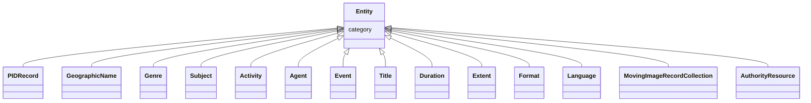

# Class: Entity


_A generic grouping for all described things_


* __NOTE__: this is an abstract class and should not be instantiated directly


URI: [avefi:Entity](https://av-efi.net/schema/av-efi-schema/Entity)





## Inheritance
* **Entity**
    * [PIDRecord](PIDRecord.md)
    * [GeographicName](GeographicName.md)
    * [Genre](Genre.md)
    * [Subject](Subject.md)
    * [Activity](Activity.md)
    * [Agent](Agent.md)
    * [Event](Event.md)
    * [Title](Title.md)
    * [Duration](Duration.md)
    * [Extent](Extent.md)
    * [Format](Format.md)
    * [Language](Language.md)
    * [MovingImageRecordCollection](MovingImageRecordCollection.md)
    * [AuthorityResource](AuthorityResource.md)


## Slots

| Name | Cardinality and Range | Description | Inheritance |
| ---  | --- | --- | --- |
| [category](category.md) | 1..1 <br/> [Uriorcurie](Uriorcurie.md) |  | direct |


## Identifier and Mapping Information


### Schema Source


* from schema: https://av-efi.net/schema/av-efi-schema


## Mappings

| Mapping Type | Mapped Value |
| ---  | ---  |
| self | avefi:Entity |
| native | avefi:Entity |


## LinkML Source

<!-- TODO: investigate https://stackoverflow.com/questions/37606292/how-to-create-tabbed-code-blocks-in-mkdocs-or-sphinx -->

### Direct

<details>
```yaml
name: Entity
description: A generic grouping for all described things
from_schema: https://av-efi.net/schema/av-efi-schema
abstract: true
slots:
- category

```
</details>

### Induced

<details>
```yaml
name: Entity
description: A generic grouping for all described things
from_schema: https://av-efi.net/schema/av-efi-schema
abstract: true
attributes:
  category:
    name: category
    from_schema: https://av-efi.net/schema/av-efi-schema
    rank: 1000
    slot_uri: rdf:type
    designates_type: true
    alias: category
    owner: Entity
    domain_of:
    - Entity
    range: uriorcurie
    required: true

```
</details>