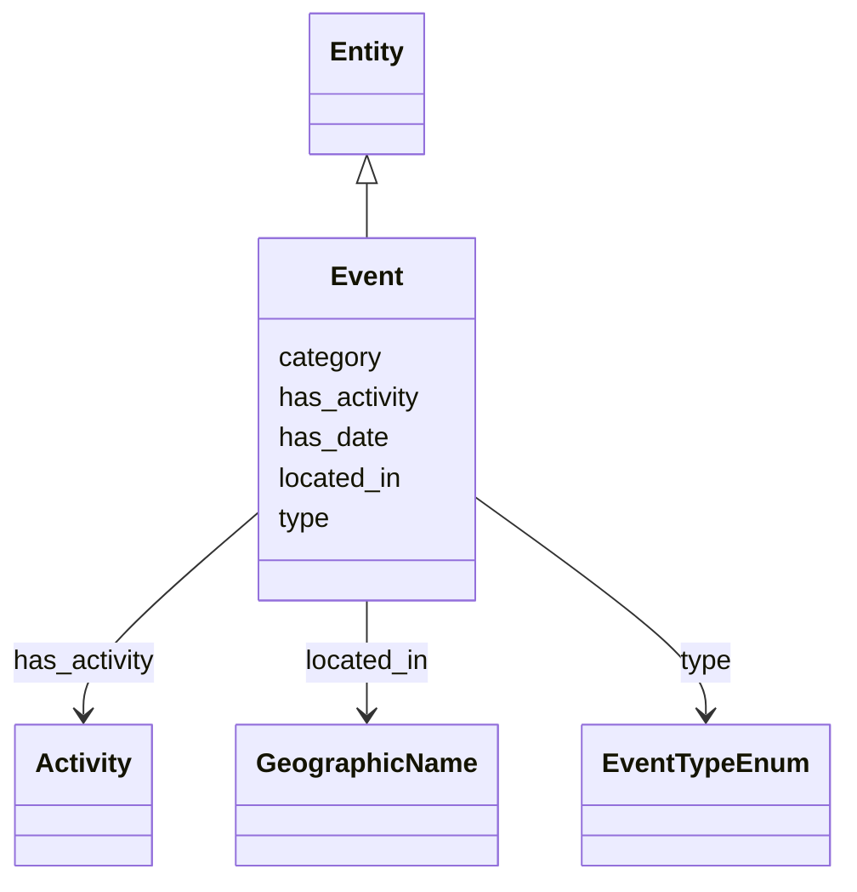

# Class: Event


_Significant event in the lifecycle of moving image work / variant, manifestation or item. Always specify the type of event and if possible a date or a period of time via has_date. Specify located_in as appropriate, e.g. the country where the principal offices or production facilities of the production company are located for a production event. Involved parties in various roles can be linked via has_activity. See also: FIAF Moving Image Cataloguing Manual 1.4.2, 2.4.2, 3.3.2_


URI: [avefi:Event](https://av-efi.net/schema/av-efi-schema/Event)





## Inheritance
* [Entity](Entity.md)
    * **Event**


## Slots

| Name | Cardinality and Range | Description | Inheritance |
| ---  | --- | --- | --- |
| [has_activity](has_activity.md) | 0..* <br/> [Activity](Activity.md) | Associate activity (and subsequently agents) with event | direct |
| [has_date](has_date.md) | 0..1 <br/> [String](String.md) | Date (or interval/period) when an event has taken place | direct |
| [located_in](located_in.md) | 0..* <br/> [GeographicName](GeographicName.md) |  | direct |
| [type](type.md) | 1..1 <br/> [EventTypeEnum](EventTypeEnum.md) |  | direct |
| [category](category.md) | 1..1 <br/> [Uriorcurie](Uriorcurie.md) |  | [Entity](Entity.md) |


## Usages

| used by | used in | type | used |
| ---  | --- | --- | --- |
| [MovingImageRecord](MovingImageRecord.md) | [has_event](has_event.md) | range | [Event](Event.md) |
| [WorkVariant](WorkVariant.md) | [has_event](has_event.md) | range | [Event](Event.md) |
| [ManifestationOrItem](ManifestationOrItem.md) | [has_event](has_event.md) | range | [Event](Event.md) |
| [Manifestation](Manifestation.md) | [has_event](has_event.md) | range | [Event](Event.md) |
| [Item](Item.md) | [has_event](has_event.md) | range | [Event](Event.md) |


## Identifier and Mapping Information


### Schema Source


* from schema: https://av-efi.net/schema/av-efi-schema


## Mappings

| Mapping Type | Mapped Value |
| ---  | ---  |
| self | avefi:Event |
| native | avefi:Event |


## LinkML Source

<!-- TODO: investigate https://stackoverflow.com/questions/37606292/how-to-create-tabbed-code-blocks-in-mkdocs-or-sphinx -->

### Direct

<details>
```yaml
name: Event
description: 'Significant event in the lifecycle of moving image work / variant, manifestation
  or item. Always specify the type of event and if possible a date or a period of
  time via has_date. Specify located_in as appropriate, e.g. the country where the
  principal offices or production facilities of the production company are located
  for a production event. Involved parties in various roles can be linked via has_activity.
  See also: FIAF Moving Image Cataloguing Manual 1.4.2, 2.4.2, 3.3.2'
from_schema: https://av-efi.net/schema/av-efi-schema
is_a: Entity
slots:
- has_activity
- has_date
- located_in
- type
slot_usage:
  type:
    name: type
    domain_of:
    - WorkVariant
    - Activity
    - Agent
    - Event
    - Title
    - Format
    - Manifestation
    range: EventTypeEnum
    required: true

```
</details>

### Induced

<details>
```yaml
name: Event
description: 'Significant event in the lifecycle of moving image work / variant, manifestation
  or item. Always specify the type of event and if possible a date or a period of
  time via has_date. Specify located_in as appropriate, e.g. the country where the
  principal offices or production facilities of the production company are located
  for a production event. Involved parties in various roles can be linked via has_activity.
  See also: FIAF Moving Image Cataloguing Manual 1.4.2, 2.4.2, 3.3.2'
from_schema: https://av-efi.net/schema/av-efi-schema
is_a: Entity
slot_usage:
  type:
    name: type
    domain_of:
    - WorkVariant
    - Activity
    - Agent
    - Event
    - Title
    - Format
    - Manifestation
    range: EventTypeEnum
    required: true
attributes:
  has_activity:
    name: has_activity
    description: Associate activity (and subsequently agents) with event
    from_schema: https://av-efi.net/schema/av-efi-schema
    rank: 1000
    multivalued: true
    alias: has_activity
    owner: Event
    domain_of:
    - Event
    range: Activity
    inlined: true
    inlined_as_list: true
  has_date:
    name: has_date
    description: Date (or interval/period) when an event has taken place. A subset
      of ISO 8601 is supported, more specifically, EDTF conformance level 0 as well
      as qualifiers ? (uncertain date) and ~ (approximate date). See examples and
      references for more information
    notes:
    - https://www.w3.org/TR/xmlschema11-2/#date
    examples:
    - value: '2024-04-24'
      description: complete date, i.e. year, month and day
    - value: 2024-04
      description: year and month
    - value: '2024'
      description: year only
    - value: 2024~
      description: approximate date (2024 or at least close to 2024)
    - value: 2024?
      description: uncertain date (2024 or may be something different)
    - value: 2023/2024
      description: interval (2023 until 2024)
    from_schema: https://av-efi.net/schema/av-efi-schema
    see_also:
    - https://www.loc.gov/standards/datetime/
    rank: 1000
    alias: has_date
    owner: Event
    domain_of:
    - Event
    range: string
    pattern: ^-?([1-9][0-9]{3,}|0[0-9]{3})(-(0[1-9]|1[0-2])(-(0[1-9]|[12][0-9]|3[01]))?)?[?~]?(/-?([1-9][0-9]{3,}|0[0-9]{3})(-(0[1-9]|1[0-2])(-(0[1-9]|[12][0-9]|3[01]))?)?[?~]?)?$
  located_in:
    name: located_in
    from_schema: https://av-efi.net/schema/av-efi-schema
    rank: 1000
    multivalued: true
    alias: located_in
    owner: Event
    domain_of:
    - Event
    range: GeographicName
    inlined: true
    inlined_as_list: true
  type:
    name: type
    from_schema: https://av-efi.net/schema/av-efi-schema
    rank: 1000
    alias: type
    owner: Event
    domain_of:
    - WorkVariant
    - Activity
    - Agent
    - Event
    - Title
    - Format
    - Manifestation
    range: EventTypeEnum
    required: true
  category:
    name: category
    from_schema: https://av-efi.net/schema/av-efi-schema
    rank: 1000
    slot_uri: rdf:type
    designates_type: true
    alias: category
    owner: Event
    domain_of:
    - Entity
    range: uriorcurie
    required: true

```
</details>