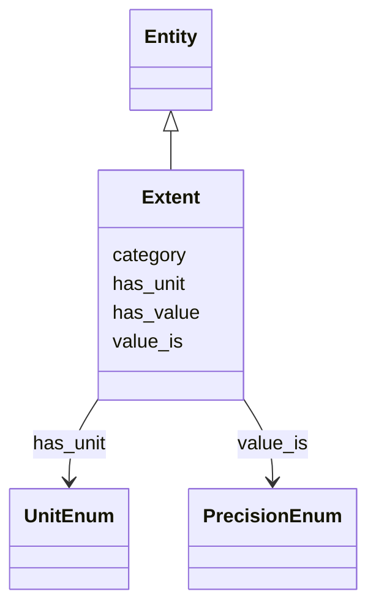

# Class: Extent


_Physical length or size of the described object. See also: FIAF Moving Image Cataloguing Manual 2.3.5.2, 3.1.5.8_


URI: [avefi:Extent](https://av-efi.net/schema/av-efi-schema/Extent)





## Inheritance
* [Entity](Entity.md)
    * **Extent**


## Slots

| Name | Cardinality and Range | Description | Inheritance |
| ---  | --- | --- | --- |
| [has_unit](has_unit.md) | 0..1 <br/> [UnitEnum](UnitEnum.md) | Unit of some quantity | direct |
| [has_value](has_value.md) | 0..1 <br/> [Decimal](Decimal.md) | Value of some quantity | direct |
| [value_is](value_is.md) | 0..1 <br/> [PrecisionEnum](PrecisionEnum.md) | Qualifier indicating the precision of an extent value or duration | direct |
| [category](category.md) | 1..1 <br/> [Uriorcurie](Uriorcurie.md) |  | [Entity](Entity.md) |


## Usages

| used by | used in | type | used |
| ---  | --- | --- | --- |
| [ManifestationOrItem](ManifestationOrItem.md) | [has_extent](has_extent.md) | range | [Extent](Extent.md) |
| [Manifestation](Manifestation.md) | [has_extent](has_extent.md) | range | [Extent](Extent.md) |
| [Item](Item.md) | [has_extent](has_extent.md) | range | [Extent](Extent.md) |


## Identifier and Mapping Information


### Schema Source


* from schema: https://av-efi.net/schema/av-efi-schema


## Mappings

| Mapping Type | Mapped Value |
| ---  | ---  |
| self | avefi:Extent |
| native | avefi:Extent |


## LinkML Source

<!-- TODO: investigate https://stackoverflow.com/questions/37606292/how-to-create-tabbed-code-blocks-in-mkdocs-or-sphinx -->

### Direct

<details>
```yaml
name: Extent
description: 'Physical length or size of the described object. See also: FIAF Moving
  Image Cataloguing Manual 2.3.5.2, 3.1.5.8'
from_schema: https://av-efi.net/schema/av-efi-schema
is_a: Entity
slots:
- has_unit
- has_value
- value_is

```
</details>

### Induced

<details>
```yaml
name: Extent
description: 'Physical length or size of the described object. See also: FIAF Moving
  Image Cataloguing Manual 2.3.5.2, 3.1.5.8'
from_schema: https://av-efi.net/schema/av-efi-schema
is_a: Entity
attributes:
  has_unit:
    name: has_unit
    description: Unit of some quantity
    from_schema: https://av-efi.net/schema/av-efi-schema
    rank: 1000
    alias: has_unit
    owner: Extent
    domain_of:
    - Extent
    range: UnitEnum
  has_value:
    name: has_value
    description: Value of some quantity
    from_schema: https://av-efi.net/schema/av-efi-schema
    rank: 1000
    alias: has_value
    owner: Extent
    domain_of:
    - Duration
    - Extent
    range: decimal
  value_is:
    name: value_is
    description: Qualifier indicating the precision of an extent value or duration
    from_schema: https://av-efi.net/schema/av-efi-schema
    rank: 1000
    alias: value_is
    owner: Extent
    domain_of:
    - Duration
    - Extent
    range: PrecisionEnum
  category:
    name: category
    from_schema: https://av-efi.net/schema/av-efi-schema
    rank: 1000
    slot_uri: rdf:type
    designates_type: true
    alias: category
    owner: Extent
    domain_of:
    - Entity
    range: uriorcurie
    required: true

```
</details>