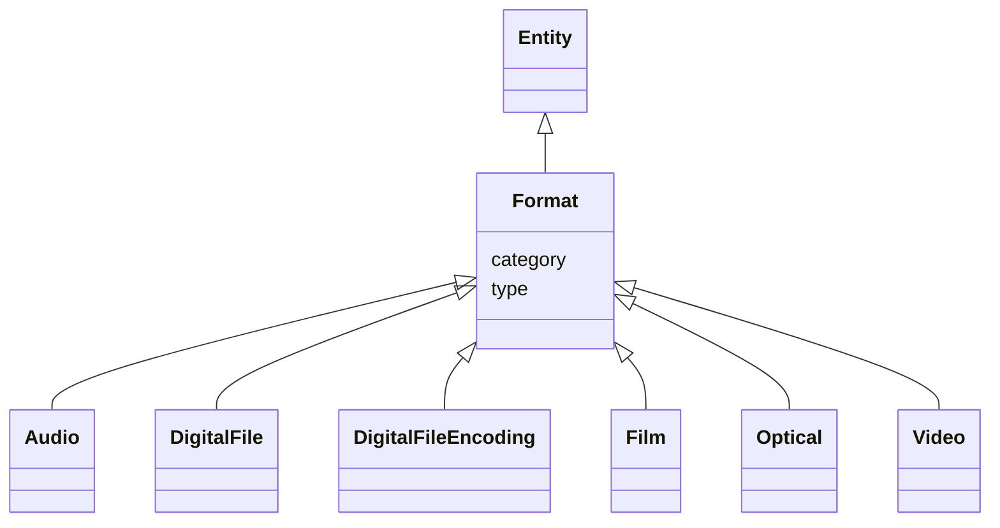

# Class: Format


_FIAF Moving Image Cataloguing Manual 2.3.4.1, 3.1.5.1_


* __NOTE__: this is an abstract class and should not be instantiated directly


URI: [avefi:Format](https://av-efi.net/schema/av-efi-schema/Format)





## Inheritance
* [Entity](Entity.md)
    * **Format**
        * [Audio](Audio.md)
        * [DigitalFile](DigitalFile.md)
        * [DigitalFileEncoding](DigitalFileEncoding.md)
        * [Film](Film.md)
        * [Optical](Optical.md)
        * [Video](Video.md)


## Slots

| Name | Cardinality and Range | Description | Inheritance |
| ---  | --- | --- | --- |
| [type](type.md) | 0..1 <br/> [Uriorcurie](Uriorcurie.md) |  | direct |
| [category](category.md) | 1..1 <br/> [Uriorcurie](Uriorcurie.md) |  | [Entity](Entity.md) |


## Usages

| used by | used in | type | used |
| ---  | --- | --- | --- |
| [ManifestationOrItem](ManifestationOrItem.md) | [has_format](has_format.md) | range | [Format](Format.md) |
| [Manifestation](Manifestation.md) | [has_format](has_format.md) | range | [Format](Format.md) |
| [Item](Item.md) | [has_format](has_format.md) | range | [Format](Format.md) |


## Identifier and Mapping Information


### Schema Source


* from schema: https://av-efi.net/schema/av-efi-schema


## Mappings

| Mapping Type | Mapped Value |
| ---  | ---  |
| self | avefi:Format |
| native | avefi:Format |


## LinkML Source

<!-- TODO: investigate https://stackoverflow.com/questions/37606292/how-to-create-tabbed-code-blocks-in-mkdocs-or-sphinx -->

### Direct

<details>
```yaml
name: Format
description: FIAF Moving Image Cataloguing Manual 2.3.4.1, 3.1.5.1
from_schema: https://av-efi.net/schema/av-efi-schema
is_a: Entity
abstract: true
slots:
- type

```
</details>

### Induced

<details>
```yaml
name: Format
description: FIAF Moving Image Cataloguing Manual 2.3.4.1, 3.1.5.1
from_schema: https://av-efi.net/schema/av-efi-schema
is_a: Entity
abstract: true
attributes:
  type:
    name: type
    from_schema: https://av-efi.net/schema/av-efi-schema
    rank: 1000
    alias: type
    owner: Format
    domain_of:
    - WorkVariant
    - Activity
    - Agent
    - Event
    - Title
    - Format
    - Manifestation
    range: uriorcurie
  category:
    name: category
    from_schema: https://av-efi.net/schema/av-efi-schema
    rank: 1000
    slot_uri: rdf:type
    designates_type: true
    alias: category
    owner: Format
    domain_of:
    - Entity
    range: uriorcurie
    required: true

```
</details>