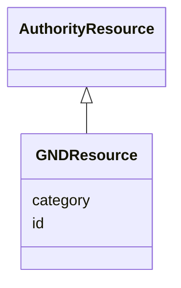

# Class: GNDResource


_Gemeinsame Normdatei (GND) identifier maintained by Deutsche Nationalbibliothek (German National Library)_


URI: [avefi:GNDResource](https://av-efi.net/schema/av-efi-schema/GNDResource)





## Inheritance
* [Entity](Entity.md)
    * [AuthorityResource](AuthorityResource.md)
        * **GNDResource**


## Slots

| Name | Cardinality and Range | Description | Inheritance |
| ---  | --- | --- | --- |
| [id](id.md) | 1..1 <br/> [String](String.md) | A unique identifier for a thing | [AuthorityResource](AuthorityResource.md) |
| [category](category.md) | 1..1 <br/> [Uriorcurie](Uriorcurie.md) |  | [Entity](Entity.md) |


## Usages

| used by | used in | type | used |
| ---  | --- | --- | --- |
| [Genre](Genre.md) | [same_as](same_as.md) | range | [GNDResource](GNDResource.md) |


## See Also

* [https://www.wikidata.org/entity/P227](https://www.wikidata.org/entity/P227)

## Identifier and Mapping Information


### Annotations

| property | value |
| --- | --- |
| formatter_uri_for_rdf_resource | https://d-nb.info/gnd/$1 || formatter_url_for_web_resource | https://d-nb.info/gnd/$1 || provides | ['CreativeWorkIdentifier', 'PlaceIdentifier', 'OrganizationIdentifier', 'PersonIdentifier', 'SubjectHeadingIdentifier'] |


### Schema Source


* from schema: https://av-efi.net/schema/av-efi-schema


## Mappings

| Mapping Type | Mapped Value |
| ---  | ---  |
| self | avefi:GNDResource |
| native | avefi:GNDResource |


## LinkML Source

<!-- TODO: investigate https://stackoverflow.com/questions/37606292/how-to-create-tabbed-code-blocks-in-mkdocs-or-sphinx -->

### Direct

<details>
```yaml
name: GNDResource
annotations:
  formatter_uri_for_rdf_resource:
    tag: formatter_uri_for_rdf_resource
    value: https://d-nb.info/gnd/$1
  formatter_url_for_web_resource:
    tag: formatter_url_for_web_resource
    value: https://d-nb.info/gnd/$1
  provides:
    tag: provides
    value:
    - CreativeWorkIdentifier
    - PlaceIdentifier
    - OrganizationIdentifier
    - PersonIdentifier
    - SubjectHeadingIdentifier
description: Gemeinsame Normdatei (GND) identifier maintained by Deutsche Nationalbibliothek
  (German National Library)
notes:
- "- alternative_web_resource: https://explore.gnd.network/gnd/$1/relations - other_resources:\n\
  \    - https://d-nb.info/gnd/$1/about/lds\n    - https://hub.culturegraph.org/entityfacts/$1\n\
  \    - https://lobid.org/gnd/$1\n- API documentation including auto-complete suggestions\
  \ at\n    https://lobid.org/gnd/api"
from_schema: https://av-efi.net/schema/av-efi-schema
see_also:
- https://www.wikidata.org/entity/P227
is_a: AuthorityResource
slot_usage:
  id:
    name: id
    domain_of:
    - PIDRecord
    - AuthorityResource
    pattern: ^[-\\dX]+$

```
</details>

### Induced

<details>
```yaml
name: GNDResource
annotations:
  formatter_uri_for_rdf_resource:
    tag: formatter_uri_for_rdf_resource
    value: https://d-nb.info/gnd/$1
  formatter_url_for_web_resource:
    tag: formatter_url_for_web_resource
    value: https://d-nb.info/gnd/$1
  provides:
    tag: provides
    value:
    - CreativeWorkIdentifier
    - PlaceIdentifier
    - OrganizationIdentifier
    - PersonIdentifier
    - SubjectHeadingIdentifier
description: Gemeinsame Normdatei (GND) identifier maintained by Deutsche Nationalbibliothek
  (German National Library)
notes:
- "- alternative_web_resource: https://explore.gnd.network/gnd/$1/relations - other_resources:\n\
  \    - https://d-nb.info/gnd/$1/about/lds\n    - https://hub.culturegraph.org/entityfacts/$1\n\
  \    - https://lobid.org/gnd/$1\n- API documentation including auto-complete suggestions\
  \ at\n    https://lobid.org/gnd/api"
from_schema: https://av-efi.net/schema/av-efi-schema
see_also:
- https://www.wikidata.org/entity/P227
is_a: AuthorityResource
slot_usage:
  id:
    name: id
    domain_of:
    - PIDRecord
    - AuthorityResource
    pattern: ^[-\\dX]+$
attributes:
  id:
    name: id
    description: A unique identifier for a thing
    from_schema: https://av-efi.net/schema/av-efi-schema
    rank: 1000
    slot_uri: schema:identifier
    identifier: true
    alias: id
    owner: GNDResource
    domain_of:
    - PIDRecord
    - AuthorityResource
    range: string
    required: true
    pattern: ^[-\\dX]+$
  category:
    name: category
    from_schema: https://av-efi.net/schema/av-efi-schema
    rank: 1000
    slot_uri: rdf:type
    designates_type: true
    alias: category
    owner: GNDResource
    domain_of:
    - Entity
    range: uriorcurie
    required: true

```
</details>