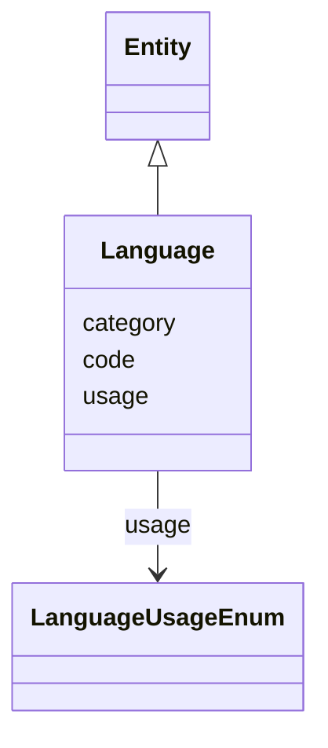

# Class: Language


_Provide language code from ISO 639-2 (Part 2: Alpha-3) and a list of language usage terms from our controlled vocabulary. See also: FIAF Moving Image Cataloguing Manual 1.3.5, 2.3.3_


URI: [avefi:Language](https://av-efi.net/schema/av-efi-schema/Language)





## Inheritance
* [Entity](Entity.md)
    * **Language**


## Slots

| Name | Cardinality and Range | Description | Inheritance |
| ---  | --- | --- | --- |
| [code](code.md) | 1..1 <br/> [String](String.md) | ISO 639-2 code for the Representation of Names of Languages (Part 2: Alpha-3) | direct |
| [usage](usage.md) | 1..* <br/> [LanguageUsageEnum](LanguageUsageEnum.md) |  | direct |
| [category](category.md) | 1..1 <br/> [Uriorcurie](Uriorcurie.md) |  | [Entity](Entity.md) |


## Usages

| used by | used in | type | used |
| ---  | --- | --- | --- |
| [MovingImageRecord](MovingImageRecord.md) | [in_language](in_language.md) | range | [Language](Language.md) |
| [WorkVariant](WorkVariant.md) | [in_language](in_language.md) | range | [Language](Language.md) |
| [ManifestationOrItem](ManifestationOrItem.md) | [in_language](in_language.md) | range | [Language](Language.md) |
| [Manifestation](Manifestation.md) | [in_language](in_language.md) | range | [Language](Language.md) |
| [Item](Item.md) | [in_language](in_language.md) | range | [Language](Language.md) |


## Identifier and Mapping Information


### Schema Source


* from schema: https://av-efi.net/schema/av-efi-schema


## Mappings

| Mapping Type | Mapped Value |
| ---  | ---  |
| self | avefi:Language |
| native | avefi:Language |


## LinkML Source

<!-- TODO: investigate https://stackoverflow.com/questions/37606292/how-to-create-tabbed-code-blocks-in-mkdocs-or-sphinx -->

### Direct

<details>
```yaml
name: Language
description: 'Provide language code from ISO 639-2 (Part 2: Alpha-3) and a list of
  language usage terms from our controlled vocabulary. See also: FIAF Moving Image
  Cataloguing Manual 1.3.5, 2.3.3'
from_schema: https://av-efi.net/schema/av-efi-schema
is_a: Entity
attributes:
  code:
    name: code
    description: 'ISO 639-2 code for the Representation of Names of Languages (Part
      2: Alpha-3)'
    from_schema: https://av-efi.net/schema/av-efi-schema
    see_also:
    - https://id.loc.gov/vocabulary/iso639-2.html
    rank: 1000
    domain_of:
    - Language
    required: true
    pattern: ^[a-z]{3}$
  usage:
    name: usage
    from_schema: https://av-efi.net/schema/av-efi-schema
    rank: 1000
    multivalued: true
    domain_of:
    - Language
    range: LanguageUsageEnum
    required: true

```
</details>

### Induced

<details>
```yaml
name: Language
description: 'Provide language code from ISO 639-2 (Part 2: Alpha-3) and a list of
  language usage terms from our controlled vocabulary. See also: FIAF Moving Image
  Cataloguing Manual 1.3.5, 2.3.3'
from_schema: https://av-efi.net/schema/av-efi-schema
is_a: Entity
attributes:
  code:
    name: code
    description: 'ISO 639-2 code for the Representation of Names of Languages (Part
      2: Alpha-3)'
    from_schema: https://av-efi.net/schema/av-efi-schema
    see_also:
    - https://id.loc.gov/vocabulary/iso639-2.html
    rank: 1000
    alias: code
    owner: Language
    domain_of:
    - Language
    range: string
    required: true
    pattern: ^[a-z]{3}$
  usage:
    name: usage
    from_schema: https://av-efi.net/schema/av-efi-schema
    rank: 1000
    multivalued: true
    alias: usage
    owner: Language
    domain_of:
    - Language
    range: LanguageUsageEnum
    required: true
  category:
    name: category
    from_schema: https://av-efi.net/schema/av-efi-schema
    rank: 1000
    slot_uri: rdf:type
    designates_type: true
    alias: category
    owner: Language
    domain_of:
    - Entity
    range: uriorcurie
    required: true

```
</details>