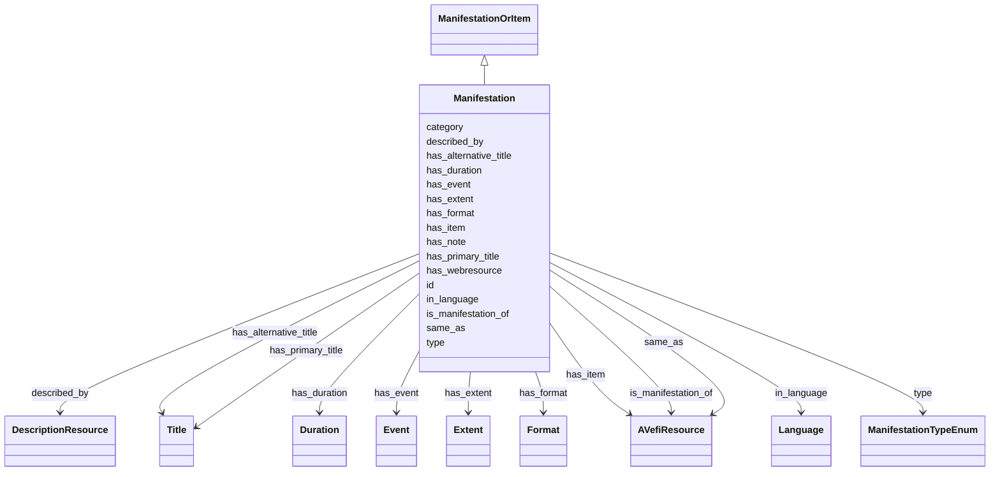

# Class: Manifestation


_FIAF Moving Image Cataloguing Manual 2.0_


URI: [avefi:Manifestation](https://av-efi.net/schema/av-efi-schema/Manifestation)





## Inheritance
* [Entity](Entity.md)
    * [PIDRecord](PIDRecord.md)
        * [MovingImageRecord](MovingImageRecord.md)
            * [ManifestationOrItem](ManifestationOrItem.md)
                * **Manifestation**


## Slots

| Name | Cardinality and Range | Description | Inheritance |
| ---  | --- | --- | --- |
| [has_item](has_item.md) | 0..* <br/> [AVefiResource](AVefiResource.md) | Indicate AVefi Items the institution has registered as part of the manifestat... | direct |
| [is_manifestation_of](is_manifestation_of.md) | 1..* <br/> [AVefiResource](AVefiResource.md) | Indicate AVefi WorkVariant (possibly more but no less than one) that is subje... | direct |
| [same_as](same_as.md) | 0..* <br/> [AVefiResource](AVefiResource.md) | Link to AVefi resource registered by another data provider indicating that th... | direct |
| [type](type.md) | 0..1 <br/> [ManifestationTypeEnum](ManifestationTypeEnum.md) |  | direct |
| [has_duration](has_duration.md) | 0..1 <br/> [Duration](Duration.md) | Total running time of the described object in ISO 8601 duration format | [ManifestationOrItem](ManifestationOrItem.md) |
| [has_extent](has_extent.md) | 0..1 <br/> [Extent](Extent.md) | Physical length or size of the described object | [ManifestationOrItem](ManifestationOrItem.md) |
| [has_format](has_format.md) | 0..* <br/> [Format](Format.md) |  | [ManifestationOrItem](ManifestationOrItem.md) |
| [has_note](has_note.md) | 0..* <br/> [String](String.md) | FIAF Moving Image Cataloguing Manual Appendix B | [ManifestationOrItem](ManifestationOrItem.md) |
| [has_webresource](has_webresource.md) | 0..1 <br/> [Uri](Uri.md) | Link to data provider's own presentation of manifestation or item on the web | [ManifestationOrItem](ManifestationOrItem.md) |
| [described_by](described_by.md) | 1..1 <br/> [DescriptionResource](DescriptionResource.md) | Also record some metadata about the PID itself rather than the identified obj... | [MovingImageRecord](MovingImageRecord.md) |
| [has_event](has_event.md) | 0..* <br/> [Event](Event.md) | Associate event(s) with a moving image record | [MovingImageRecord](MovingImageRecord.md) |
| [in_language](in_language.md) | 0..* <br/> [Language](Language.md) | FIAF Moving Image Cataloguing Manual 1 | [MovingImageRecord](MovingImageRecord.md) |
| [has_alternative_title](has_alternative_title.md) | 0..* <br/> [Title](Title.md) | Additional title(s) associated with the work / variant, manifestation, or ite... | [MovingImageRecord](MovingImageRecord.md) |
| [has_primary_title](has_primary_title.md) | 1..1 <br/> [Title](Title.md) | Primary title to be displayed in search results etc | [MovingImageRecord](MovingImageRecord.md) |
| [id](id.md) | 1..1 <br/> [Uriorcurie](Uriorcurie.md) | A unique identifier for a thing | [PIDRecord](PIDRecord.md) |
| [category](category.md) | 1..1 <br/> [Uriorcurie](Uriorcurie.md) |  | [Entity](Entity.md) |


## Identifier and Mapping Information


### Schema Source


* from schema: https://av-efi.net/schema/av-efi-schema


## Mappings

| Mapping Type | Mapped Value |
| ---  | ---  |
| self | avefi:Manifestation |
| native | avefi:Manifestation |
| close | fiaf:Manifestation |


## LinkML Source

<!-- TODO: investigate https://stackoverflow.com/questions/37606292/how-to-create-tabbed-code-blocks-in-mkdocs-or-sphinx -->

### Direct

<details>
```yaml
name: Manifestation
description: FIAF Moving Image Cataloguing Manual 2.0
from_schema: https://av-efi.net/schema/av-efi-schema
close_mappings:
- fiaf:Manifestation
is_a: ManifestationOrItem
slots:
- has_item
- is_manifestation_of
- same_as
- type
slot_usage:
  same_as:
    name: same_as
    description: Link to AVefi resource registered by another data provider indicating
      that the two manifestations are known to be the same. Use this, for instance,
      when you have cooperated in making a digital restoration of some film work
    domain_of:
    - WorkVariant
    - GeographicName
    - Genre
    - Subject
    - Agent
    - Manifestation
    range: AVefiResource
  type:
    name: type
    domain_of:
    - WorkVariant
    - Activity
    - Agent
    - Event
    - Title
    - Format
    - Manifestation
    range: ManifestationTypeEnum

```
</details>

### Induced

<details>
```yaml
name: Manifestation
description: FIAF Moving Image Cataloguing Manual 2.0
from_schema: https://av-efi.net/schema/av-efi-schema
close_mappings:
- fiaf:Manifestation
is_a: ManifestationOrItem
slot_usage:
  same_as:
    name: same_as
    description: Link to AVefi resource registered by another data provider indicating
      that the two manifestations are known to be the same. Use this, for instance,
      when you have cooperated in making a digital restoration of some film work
    domain_of:
    - WorkVariant
    - GeographicName
    - Genre
    - Subject
    - Agent
    - Manifestation
    range: AVefiResource
  type:
    name: type
    domain_of:
    - WorkVariant
    - Activity
    - Agent
    - Event
    - Title
    - Format
    - Manifestation
    range: ManifestationTypeEnum
attributes:
  has_item:
    name: has_item
    description: Indicate AVefi Items the institution has registered as part of the
      manifestation
    from_schema: https://av-efi.net/schema/av-efi-schema
    rank: 1000
    multivalued: true
    alias: has_item
    owner: Manifestation
    domain_of:
    - Manifestation
    range: AVefiResource
    inlined: true
    inlined_as_list: true
  is_manifestation_of:
    name: is_manifestation_of
    description: Indicate AVefi WorkVariant (possibly more but no less than one) that
      is subject of the manifestation
    from_schema: https://av-efi.net/schema/av-efi-schema
    rank: 1000
    multivalued: true
    alias: is_manifestation_of
    owner: Manifestation
    domain_of:
    - Manifestation
    range: AVefiResource
    required: true
    inlined: true
    inlined_as_list: true
  same_as:
    name: same_as
    description: Link to AVefi resource registered by another data provider indicating
      that the two manifestations are known to be the same. Use this, for instance,
      when you have cooperated in making a digital restoration of some film work
    from_schema: https://av-efi.net/schema/av-efi-schema
    rank: 1000
    multivalued: true
    alias: same_as
    owner: Manifestation
    domain_of:
    - WorkVariant
    - GeographicName
    - Genre
    - Subject
    - Agent
    - Manifestation
    range: AVefiResource
    inlined: true
    inlined_as_list: true
  type:
    name: type
    from_schema: https://av-efi.net/schema/av-efi-schema
    rank: 1000
    alias: type
    owner: Manifestation
    domain_of:
    - WorkVariant
    - Activity
    - Agent
    - Event
    - Title
    - Format
    - Manifestation
    range: ManifestationTypeEnum
  has_duration:
    name: has_duration
    description: 'Total running time of the described object in ISO 8601 duration
      format. See also: FIAF Moving Image Cataloguing Manual 2.3.5.3, 3.1.5.11'
    from_schema: https://av-efi.net/schema/av-efi-schema
    rank: 1000
    alias: has_duration
    owner: Manifestation
    domain_of:
    - ManifestationOrItem
    range: Duration
  has_extent:
    name: has_extent
    description: 'Physical length or size of the described object. See also: FIAF
      Moving Image Cataloguing Manual 2.3.5.2, 3.1.5.8'
    from_schema: https://av-efi.net/schema/av-efi-schema
    rank: 1000
    alias: has_extent
    owner: Manifestation
    domain_of:
    - ManifestationOrItem
    range: Extent
  has_format:
    name: has_format
    from_schema: https://av-efi.net/schema/av-efi-schema
    rank: 1000
    multivalued: true
    alias: has_format
    owner: Manifestation
    domain_of:
    - ManifestationOrItem
    range: Format
    inlined: true
    inlined_as_list: true
  has_note:
    name: has_note
    description: FIAF Moving Image Cataloguing Manual Appendix B
    from_schema: https://av-efi.net/schema/av-efi-schema
    rank: 1000
    multivalued: true
    alias: has_note
    owner: Manifestation
    domain_of:
    - ManifestationOrItem
    range: string
    inlined: true
    inlined_as_list: true
  has_webresource:
    name: has_webresource
    description: Link to data provider's own presentation of manifestation or item
      on the web
    from_schema: https://av-efi.net/schema/av-efi-schema
    rank: 1000
    alias: has_webresource
    owner: Manifestation
    domain_of:
    - ManifestationOrItem
    range: uri
  described_by:
    name: described_by
    description: Also record some metadata about the PID itself rather than the identified
      object
    from_schema: https://av-efi.net/schema/av-efi-schema
    rank: 1000
    slot_uri: wdrs:describedby
    alias: described_by
    owner: Manifestation
    domain_of:
    - MovingImageRecord
    range: DescriptionResource
    required: true
    inlined: true
  has_event:
    name: has_event
    description: Associate event(s) with a moving image record
    from_schema: https://av-efi.net/schema/av-efi-schema
    rank: 1000
    multivalued: true
    alias: has_event
    owner: Manifestation
    domain_of:
    - MovingImageRecord
    range: Event
    inlined: true
    inlined_as_list: true
  in_language:
    name: in_language
    description: FIAF Moving Image Cataloguing Manual 1.3.5, 2.3.3
    from_schema: https://av-efi.net/schema/av-efi-schema
    related_mappings:
    - fiaf:hasLanguage
    - schema:inLanguage
    rank: 1000
    multivalued: true
    alias: in_language
    owner: Manifestation
    domain_of:
    - MovingImageRecord
    range: Language
    inlined: true
    inlined_as_list: true
  has_alternative_title:
    name: has_alternative_title
    description: Additional title(s) associated with the work / variant, manifestation,
      or item.
    from_schema: https://av-efi.net/schema/av-efi-schema
    rank: 1000
    multivalued: true
    alias: has_alternative_title
    owner: Manifestation
    domain_of:
    - MovingImageRecord
    range: Title
    inlined: true
    inlined_as_list: true
  has_primary_title:
    name: has_primary_title
    description: Primary title to be displayed in search results etc. The type should
      be PreferredTitle for works / variants and TitleProper for manifestations /
      items. If not available, type must be SuppliedDevisedTitle, instead.
    from_schema: https://av-efi.net/schema/av-efi-schema
    rank: 1000
    alias: has_primary_title
    owner: Manifestation
    domain_of:
    - MovingImageRecord
    range: Title
    required: true
  id:
    name: id
    description: A unique identifier for a thing
    from_schema: https://av-efi.net/schema/av-efi-schema
    rank: 1000
    slot_uri: schema:identifier
    identifier: true
    alias: id
    owner: Manifestation
    domain_of:
    - PIDRecord
    - AuthorityResource
    range: uriorcurie
    required: true
  category:
    name: category
    from_schema: https://av-efi.net/schema/av-efi-schema
    rank: 1000
    slot_uri: rdf:type
    designates_type: true
    alias: category
    owner: Manifestation
    domain_of:
    - Entity
    range: uriorcurie
    required: true

```
</details>