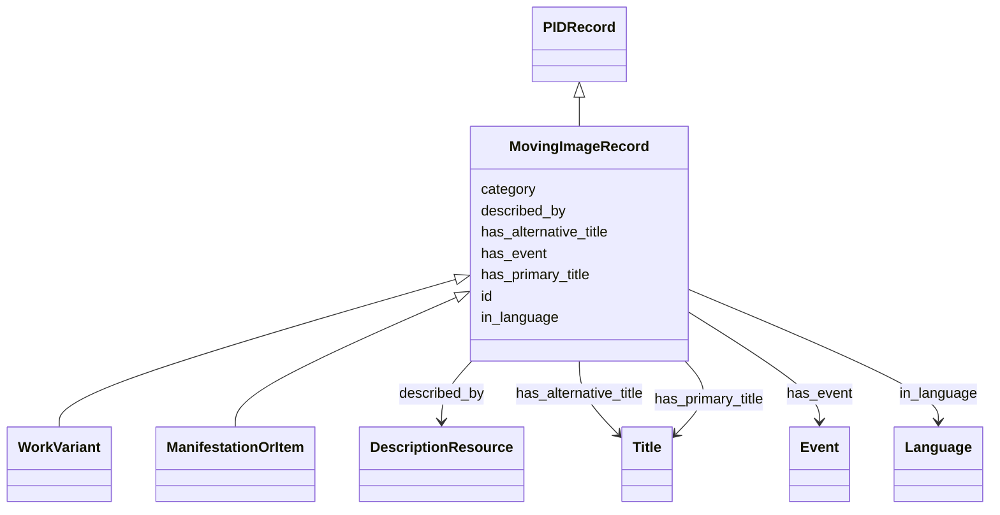

# Class: MovingImageRecord


* __NOTE__: this is an abstract class and should not be instantiated directly


URI: [avefi:MovingImageRecord](https://av-efi.net/schema/av-efi-schema/MovingImageRecord)





## Inheritance
* [Entity](Entity.md)
    * [PIDRecord](PIDRecord.md)
        * **MovingImageRecord**
            * [WorkVariant](WorkVariant.md)
            * [ManifestationOrItem](ManifestationOrItem.md)


## Slots

| Name | Cardinality and Range | Description | Inheritance |
| ---  | --- | --- | --- |
| [described_by](described_by.md) | 1..1 <br/> [DescriptionResource](DescriptionResource.md) | Also record some metadata about the PID itself rather than the identified obj... | direct |
| [has_event](has_event.md) | 0..* <br/> [Event](Event.md) | Associate event(s) with a moving image record | direct |
| [in_language](in_language.md) | 0..* <br/> [Language](Language.md) | FIAF Moving Image Cataloguing Manual 1 | direct |
| [has_alternative_title](has_alternative_title.md) | 0..* <br/> [Title](Title.md) | Additional title(s) associated with the work / variant, manifestation, or ite... | direct |
| [has_primary_title](has_primary_title.md) | 1..1 <br/> [Title](Title.md) | Primary title to be displayed in search results etc | direct |
| [id](id.md) | 1..1 <br/> [Uriorcurie](Uriorcurie.md) | A unique identifier for a thing | [PIDRecord](PIDRecord.md) |
| [category](category.md) | 1..1 <br/> [Uriorcurie](Uriorcurie.md) |  | [Entity](Entity.md) |


## Usages

| used by | used in | type | used |
| ---  | --- | --- | --- |
| [MovingImageRecordCollection](MovingImageRecordCollection.md) | [has_record](has_record.md) | range | [MovingImageRecord](MovingImageRecord.md) |


## Identifier and Mapping Information


### Schema Source


* from schema: https://av-efi.net/schema/av-efi-schema


## Mappings

| Mapping Type | Mapped Value |
| ---  | ---  |
| self | avefi:MovingImageRecord |
| native | avefi:MovingImageRecord |


## LinkML Source

<!-- TODO: investigate https://stackoverflow.com/questions/37606292/how-to-create-tabbed-code-blocks-in-mkdocs-or-sphinx -->

### Direct

<details>
```yaml
name: MovingImageRecord
from_schema: https://av-efi.net/schema/av-efi-schema
is_a: PIDRecord
abstract: true
slots:
- described_by
- has_event
- in_language
attributes:
  has_alternative_title:
    name: has_alternative_title
    description: Additional title(s) associated with the work / variant, manifestation,
      or item.
    from_schema: https://av-efi.net/schema/av-efi-schema
    rank: 1000
    multivalued: true
    domain_of:
    - MovingImageRecord
    range: Title
    inlined: true
    inlined_as_list: true
  has_primary_title:
    name: has_primary_title
    description: Primary title to be displayed in search results etc. The type should
      be PreferredTitle for works / variants and TitleProper for manifestations /
      items. If not available, type must be SuppliedDevisedTitle, instead.
    from_schema: https://av-efi.net/schema/av-efi-schema
    rank: 1000
    domain_of:
    - MovingImageRecord
    range: Title
    required: true

```
</details>

### Induced

<details>
```yaml
name: MovingImageRecord
from_schema: https://av-efi.net/schema/av-efi-schema
is_a: PIDRecord
abstract: true
attributes:
  has_alternative_title:
    name: has_alternative_title
    description: Additional title(s) associated with the work / variant, manifestation,
      or item.
    from_schema: https://av-efi.net/schema/av-efi-schema
    rank: 1000
    multivalued: true
    alias: has_alternative_title
    owner: MovingImageRecord
    domain_of:
    - MovingImageRecord
    range: Title
    inlined: true
    inlined_as_list: true
  has_primary_title:
    name: has_primary_title
    description: Primary title to be displayed in search results etc. The type should
      be PreferredTitle for works / variants and TitleProper for manifestations /
      items. If not available, type must be SuppliedDevisedTitle, instead.
    from_schema: https://av-efi.net/schema/av-efi-schema
    rank: 1000
    alias: has_primary_title
    owner: MovingImageRecord
    domain_of:
    - MovingImageRecord
    range: Title
    required: true
  described_by:
    name: described_by
    description: Also record some metadata about the PID itself rather than the identified
      object
    from_schema: https://av-efi.net/schema/av-efi-schema
    rank: 1000
    slot_uri: wdrs:describedby
    alias: described_by
    owner: MovingImageRecord
    domain_of:
    - MovingImageRecord
    range: DescriptionResource
    required: true
    inlined: true
  has_event:
    name: has_event
    description: Associate event(s) with a moving image record
    from_schema: https://av-efi.net/schema/av-efi-schema
    rank: 1000
    multivalued: true
    alias: has_event
    owner: MovingImageRecord
    domain_of:
    - MovingImageRecord
    range: Event
    inlined: true
    inlined_as_list: true
  in_language:
    name: in_language
    description: FIAF Moving Image Cataloguing Manual 1.3.5, 2.3.3
    from_schema: https://av-efi.net/schema/av-efi-schema
    related_mappings:
    - fiaf:hasLanguage
    - schema:inLanguage
    rank: 1000
    multivalued: true
    alias: in_language
    owner: MovingImageRecord
    domain_of:
    - MovingImageRecord
    range: Language
    inlined: true
    inlined_as_list: true
  id:
    name: id
    description: A unique identifier for a thing
    from_schema: https://av-efi.net/schema/av-efi-schema
    rank: 1000
    slot_uri: schema:identifier
    identifier: true
    alias: id
    owner: MovingImageRecord
    domain_of:
    - PIDRecord
    - AuthorityResource
    range: uriorcurie
    required: true
  category:
    name: category
    from_schema: https://av-efi.net/schema/av-efi-schema
    rank: 1000
    slot_uri: rdf:type
    designates_type: true
    alias: category
    owner: MovingImageRecord
    domain_of:
    - Entity
    range: uriorcurie
    required: true

```
</details>