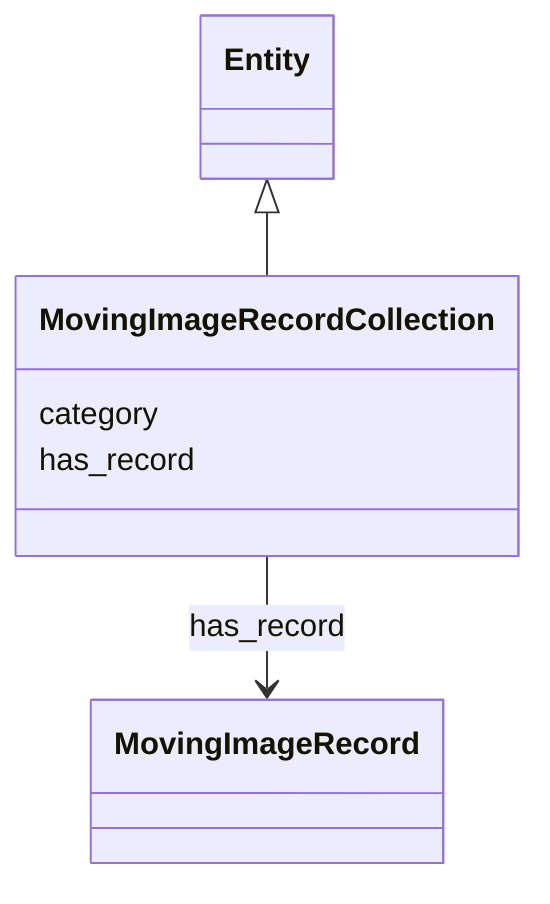

# Class: MovingImageRecordCollection


_A holder for MovingImageRecord objects_


URI: [avefi:MovingImageRecordCollection](https://av-efi.net/schema/av-efi-schema/MovingImageRecordCollection)





## Inheritance
* [Entity](Entity.md)
    * **MovingImageRecordCollection**


## Slots

| Name | Cardinality and Range | Description | Inheritance |
| ---  | --- | --- | --- |
| [has_record](has_record.md) | 0..* <br/> [MovingImageRecord](MovingImageRecord.md) |  | direct |
| [category](category.md) | 1..1 <br/> [Uriorcurie](Uriorcurie.md) |  | [Entity](Entity.md) |


## Identifier and Mapping Information


### Schema Source


* from schema: https://av-efi.net/schema/av-efi-schema


## Mappings

| Mapping Type | Mapped Value |
| ---  | ---  |
| self | avefi:MovingImageRecordCollection |
| native | avefi:MovingImageRecordCollection |


## LinkML Source

<!-- TODO: investigate https://stackoverflow.com/questions/37606292/how-to-create-tabbed-code-blocks-in-mkdocs-or-sphinx -->

### Direct

<details>
```yaml
name: MovingImageRecordCollection
description: A holder for MovingImageRecord objects
from_schema: https://av-efi.net/schema/av-efi-schema
is_a: Entity
slots:
- has_record
tree_root: true

```
</details>

### Induced

<details>
```yaml
name: MovingImageRecordCollection
description: A holder for MovingImageRecord objects
from_schema: https://av-efi.net/schema/av-efi-schema
is_a: Entity
attributes:
  has_record:
    name: has_record
    from_schema: https://av-efi.net/schema/av-efi-schema
    rank: 1000
    multivalued: true
    alias: has_record
    owner: MovingImageRecordCollection
    domain_of:
    - MovingImageRecordCollection
    range: MovingImageRecord
    inlined: true
    inlined_as_list: true
  category:
    name: category
    from_schema: https://av-efi.net/schema/av-efi-schema
    rank: 1000
    slot_uri: rdf:type
    designates_type: true
    alias: category
    owner: MovingImageRecordCollection
    domain_of:
    - Entity
    range: uriorcurie
    required: true
tree_root: true

```
</details>