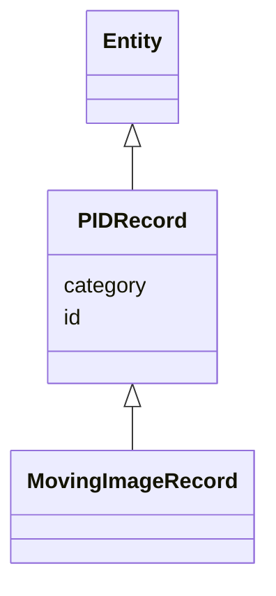

# Class: PIDRecord


_Grouping for all entities that represent a PID metadata record_


* __NOTE__: this is an abstract class and should not be instantiated directly


URI: [avefi:PIDRecord](https://av-efi.net/schema/av-efi-schema/PIDRecord)





## Inheritance
* [Entity](Entity.md)
    * **PIDRecord**
        * [MovingImageRecord](MovingImageRecord.md)


## Slots

| Name | Cardinality and Range | Description | Inheritance |
| ---  | --- | --- | --- |
| [id](id.md) | 1..1 <br/> [Uriorcurie](Uriorcurie.md) | A unique identifier for a thing | direct |
| [category](category.md) | 1..1 <br/> [Uriorcurie](Uriorcurie.md) |  | [Entity](Entity.md) |


## Identifier and Mapping Information


### Schema Source


* from schema: https://av-efi.net/schema/av-efi-schema


## Mappings

| Mapping Type | Mapped Value |
| ---  | ---  |
| self | avefi:PIDRecord |
| native | avefi:PIDRecord |


## LinkML Source

<!-- TODO: investigate https://stackoverflow.com/questions/37606292/how-to-create-tabbed-code-blocks-in-mkdocs-or-sphinx -->

### Direct

<details>
```yaml
name: PIDRecord
description: Grouping for all entities that represent a PID metadata record
from_schema: https://av-efi.net/schema/av-efi-schema
is_a: Entity
abstract: true
slots:
- id

```
</details>

### Induced

<details>
```yaml
name: PIDRecord
description: Grouping for all entities that represent a PID metadata record
from_schema: https://av-efi.net/schema/av-efi-schema
is_a: Entity
abstract: true
attributes:
  id:
    name: id
    description: A unique identifier for a thing
    from_schema: https://av-efi.net/schema/av-efi-schema
    rank: 1000
    slot_uri: schema:identifier
    identifier: true
    alias: id
    owner: PIDRecord
    domain_of:
    - PIDRecord
    - AuthorityResource
    range: uriorcurie
    required: true
  category:
    name: category
    from_schema: https://av-efi.net/schema/av-efi-schema
    rank: 1000
    slot_uri: rdf:type
    designates_type: true
    alias: category
    owner: PIDRecord
    domain_of:
    - Entity
    range: uriorcurie
    required: true

```
</details>