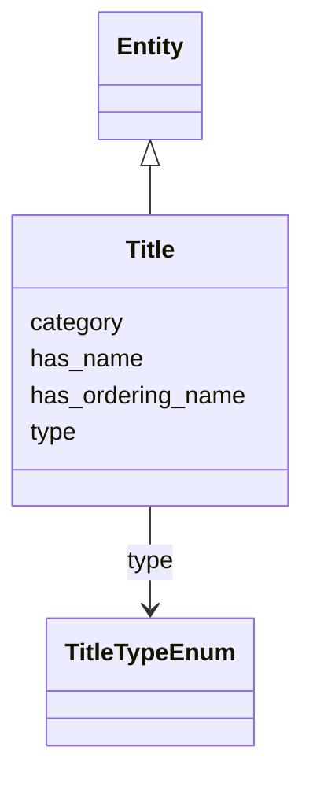

# Class: Title


_FIAF Moving Image Cataloguing Manual 1.3.2, 2.3.2, 3.1.2_


URI: [avefi:Title](https://av-efi.net/schema/av-efi-schema/Title)





## Inheritance
* [Entity](Entity.md)
    * **Title**


## Slots

| Name | Cardinality and Range | Description | Inheritance |
| ---  | --- | --- | --- |
| [has_name](has_name.md) | 1..1 <br/> [String](String.md) | A human-readable name for a thing | direct |
| [has_ordering_name](has_ordering_name.md) | 0..1 <br/> [String](String.md) | Provide normalised form, e | direct |
| [type](type.md) | 1..1 <br/> [TitleTypeEnum](TitleTypeEnum.md) | FIAF Moving Image Cataloguing Manual A | direct |
| [category](category.md) | 1..1 <br/> [Uriorcurie](Uriorcurie.md) |  | [Entity](Entity.md) |


## Usages

| used by | used in | type | used |
| ---  | --- | --- | --- |
| [MovingImageRecord](MovingImageRecord.md) | [has_alternative_title](has_alternative_title.md) | range | [Title](Title.md) |
| [MovingImageRecord](MovingImageRecord.md) | [has_primary_title](has_primary_title.md) | range | [Title](Title.md) |
| [WorkVariant](WorkVariant.md) | [has_alternative_title](has_alternative_title.md) | range | [Title](Title.md) |
| [WorkVariant](WorkVariant.md) | [has_primary_title](has_primary_title.md) | range | [Title](Title.md) |
| [ManifestationOrItem](ManifestationOrItem.md) | [has_alternative_title](has_alternative_title.md) | range | [Title](Title.md) |
| [ManifestationOrItem](ManifestationOrItem.md) | [has_primary_title](has_primary_title.md) | range | [Title](Title.md) |
| [Manifestation](Manifestation.md) | [has_alternative_title](has_alternative_title.md) | range | [Title](Title.md) |
| [Manifestation](Manifestation.md) | [has_primary_title](has_primary_title.md) | range | [Title](Title.md) |
| [Item](Item.md) | [has_alternative_title](has_alternative_title.md) | range | [Title](Title.md) |
| [Item](Item.md) | [has_primary_title](has_primary_title.md) | range | [Title](Title.md) |


## Identifier and Mapping Information


### Schema Source


* from schema: https://av-efi.net/schema/av-efi-schema


## Mappings

| Mapping Type | Mapped Value |
| ---  | ---  |
| self | avefi:Title |
| native | avefi:Title |


## LinkML Source

<!-- TODO: investigate https://stackoverflow.com/questions/37606292/how-to-create-tabbed-code-blocks-in-mkdocs-or-sphinx -->

### Direct

<details>
```yaml
name: Title
description: FIAF Moving Image Cataloguing Manual 1.3.2, 2.3.2, 3.1.2
from_schema: https://av-efi.net/schema/av-efi-schema
is_a: Entity
slots:
- has_name
- has_ordering_name
- type
slot_usage:
  has_name:
    name: has_name
    close_mappings:
    - fiaf:hasTitleValue
    - schema:name
    domain_of:
    - GeographicName
    - Genre
    - Subject
    - Agent
    - Title
  type:
    name: type
    description: FIAF Moving Image Cataloguing Manual A.2
    domain_of:
    - WorkVariant
    - Activity
    - Agent
    - Event
    - Title
    - Format
    - Manifestation
    range: TitleTypeEnum
    required: true

```
</details>

### Induced

<details>
```yaml
name: Title
description: FIAF Moving Image Cataloguing Manual 1.3.2, 2.3.2, 3.1.2
from_schema: https://av-efi.net/schema/av-efi-schema
is_a: Entity
slot_usage:
  has_name:
    name: has_name
    close_mappings:
    - fiaf:hasTitleValue
    - schema:name
    domain_of:
    - GeographicName
    - Genre
    - Subject
    - Agent
    - Title
  type:
    name: type
    description: FIAF Moving Image Cataloguing Manual A.2
    domain_of:
    - WorkVariant
    - Activity
    - Agent
    - Event
    - Title
    - Format
    - Manifestation
    range: TitleTypeEnum
    required: true
attributes:
  has_name:
    name: has_name
    description: A human-readable name for a thing
    from_schema: https://av-efi.net/schema/av-efi-schema
    close_mappings:
    - fiaf:hasTitleValue
    - schema:name
    rank: 1000
    slot_uri: schema:name
    alias: has_name
    owner: Title
    domain_of:
    - GeographicName
    - Genre
    - Subject
    - Agent
    - Title
    range: string
    required: true
  has_ordering_name:
    name: has_ordering_name
    description: Provide normalised form, e.g. for sorting by title
    examples:
    - value: American in Paris, An
      description: 'For display title: An American in Paris'
    - value: 'Star Wars: Episode 9 – Der Aufstieg Skywalkers'
      description: 'For display title: Star Wars: Episode IX – Der Aufstieg Skywalkers'
    from_schema: https://av-efi.net/schema/av-efi-schema
    rank: 1000
    alias: has_ordering_name
    owner: Title
    domain_of:
    - Title
    range: string
  type:
    name: type
    description: FIAF Moving Image Cataloguing Manual A.2
    from_schema: https://av-efi.net/schema/av-efi-schema
    rank: 1000
    alias: type
    owner: Title
    domain_of:
    - WorkVariant
    - Activity
    - Agent
    - Event
    - Title
    - Format
    - Manifestation
    range: TitleTypeEnum
    required: true
  category:
    name: category
    from_schema: https://av-efi.net/schema/av-efi-schema
    rank: 1000
    slot_uri: rdf:type
    designates_type: true
    alias: category
    owner: Title
    domain_of:
    - Entity
    range: uriorcurie
    required: true

```
</details>