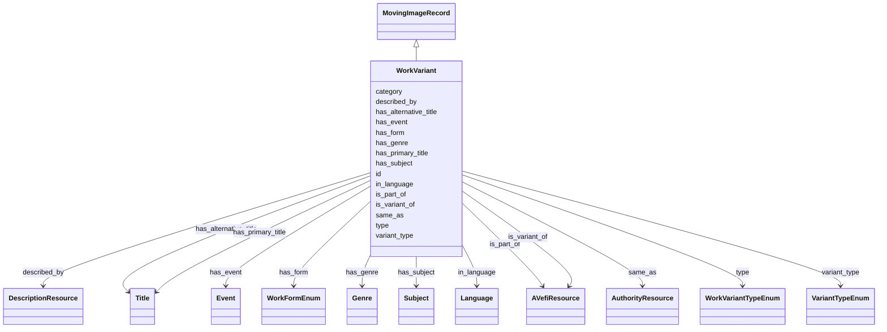

# Class: WorkVariant


_FIAF Moving Image Cataloguing Manual 1.0_


URI: [avefi:WorkVariant](https://av-efi.net/schema/av-efi-schema/WorkVariant)





## Inheritance
* [Entity](Entity.md)
    * [PIDRecord](PIDRecord.md)
        * [MovingImageRecord](MovingImageRecord.md)
            * **WorkVariant**


## Slots

| Name | Cardinality and Range | Description | Inheritance |
| ---  | --- | --- | --- |
| [has_form](has_form.md) | 0..* <br/> [WorkFormEnum](WorkFormEnum.md) | Form describes the format and/or purpose of a Work, e | direct |
| [has_genre](has_genre.md) | 0..* <br/> [Genre](Genre.md) | Genre describes categories of Works, characterized by similar plots, themes, ... | direct |
| [has_subject](has_subject.md) | 0..* <br/> [Subject](Subject.md) | Subject descriptor terms for the content of a film specifying its period, the... | direct |
| [is_part_of](is_part_of.md) | 0..* <br/> [AVefiResource](AVefiResource.md) | Relate, for instance, episodes to a series / serial | direct |
| [is_variant_of](is_variant_of.md) | 0..1 <br/> [AVefiResource](AVefiResource.md) | Link to the reference WorkVariant for the currently described variant | direct |
| [same_as](same_as.md) | 0..* <br/> [AuthorityResource](AuthorityResource.md) |  | direct |
| [type](type.md) | 1..1 <br/> [WorkVariantTypeEnum](WorkVariantTypeEnum.md) |  | direct |
| [variant_type](variant_type.md) | 0..1 <br/> [VariantTypeEnum](VariantTypeEnum.md) | FIAF Moving Image Cataloguing Manual D | direct |
| [described_by](described_by.md) | 1..1 <br/> [DescriptionResource](DescriptionResource.md) | Also record some metadata about the PID itself rather than the identified obj... | [MovingImageRecord](MovingImageRecord.md) |
| [has_event](has_event.md) | 0..* <br/> [Event](Event.md) | Associate event(s) with a moving image record | [MovingImageRecord](MovingImageRecord.md) |
| [in_language](in_language.md) | 0..* <br/> [Language](Language.md) | FIAF Moving Image Cataloguing Manual 1 | [MovingImageRecord](MovingImageRecord.md) |
| [has_alternative_title](has_alternative_title.md) | 0..* <br/> [Title](Title.md) | Additional title(s) associated with the work / variant, manifestation, or ite... | [MovingImageRecord](MovingImageRecord.md) |
| [has_primary_title](has_primary_title.md) | 1..1 <br/> [Title](Title.md) | Primary title to be displayed in search results etc | [MovingImageRecord](MovingImageRecord.md) |
| [id](id.md) | 1..1 <br/> [Uriorcurie](Uriorcurie.md) | A unique identifier for a thing | [PIDRecord](PIDRecord.md) |
| [category](category.md) | 1..1 <br/> [Uriorcurie](Uriorcurie.md) |  | [Entity](Entity.md) |


## Identifier and Mapping Information


### Schema Source


* from schema: https://av-efi.net/schema/av-efi-schema


## Mappings

| Mapping Type | Mapped Value |
| ---  | ---  |
| self | avefi:WorkVariant |
| native | avefi:WorkVariant |
| related | fiaf:WorkVariant |


## LinkML Source

<!-- TODO: investigate https://stackoverflow.com/questions/37606292/how-to-create-tabbed-code-blocks-in-mkdocs-or-sphinx -->

### Direct

<details>
```yaml
name: WorkVariant
description: FIAF Moving Image Cataloguing Manual 1.0
from_schema: https://av-efi.net/schema/av-efi-schema
related_mappings:
- fiaf:WorkVariant
is_a: MovingImageRecord
slots:
- has_form
- has_genre
- has_subject
- is_part_of
- is_variant_of
- same_as
- type
- variant_type
slot_usage:
  type:
    name: type
    domain_of:
    - WorkVariant
    - Activity
    - Agent
    - Event
    - Title
    - Format
    - Manifestation
    range: WorkVariantTypeEnum
    required: true

```
</details>

### Induced

<details>
```yaml
name: WorkVariant
description: FIAF Moving Image Cataloguing Manual 1.0
from_schema: https://av-efi.net/schema/av-efi-schema
related_mappings:
- fiaf:WorkVariant
is_a: MovingImageRecord
slot_usage:
  type:
    name: type
    domain_of:
    - WorkVariant
    - Activity
    - Agent
    - Event
    - Title
    - Format
    - Manifestation
    range: WorkVariantTypeEnum
    required: true
attributes:
  has_form:
    name: has_form
    description: 'Form describes the format and/or purpose of a Work, e.g., “non-fiction”,
      “short” and “animation”. See also: FIAF Moving Image Cataloguing Manual 1.4.3
      and FIAF Glossary of Filmographic Terms D.1'
    from_schema: https://av-efi.net/schema/av-efi-schema
    rank: 1000
    multivalued: true
    alias: has_form
    owner: WorkVariant
    domain_of:
    - WorkVariant
    range: WorkFormEnum
  has_genre:
    name: has_genre
    description: 'Genre describes categories of Works, characterized by similar plots,
      themes, settings, situations, and characters. Examples of genres are “westerns”
      and “thrillers”. See also: FIAF Moving Image Cataloguing Manual 1.4.3 and FIAF
      Glossary of Filmographic Terms D.2.1'
    from_schema: https://av-efi.net/schema/av-efi-schema
    rank: 1000
    multivalued: true
    alias: has_genre
    owner: WorkVariant
    domain_of:
    - WorkVariant
    range: Genre
    inlined: true
    inlined_as_list: true
  has_subject:
    name: has_subject
    description: 'Subject descriptor terms for the content of a film specifying its
      period, themes, locations, etc. Not to be confused with Genre. See also: FIAF
      Moving Image Cataloguing Manual 1.4.3 and FIAF Glossary of Filmographic Terms
      D.2.3'
    from_schema: https://av-efi.net/schema/av-efi-schema
    rank: 1000
    multivalued: true
    alias: has_subject
    owner: WorkVariant
    domain_of:
    - WorkVariant
    range: Subject
    inlined: true
    inlined_as_list: true
  is_part_of:
    name: is_part_of
    description: 'Relate, for instance, episodes to a series / serial. See also: FIAF
      Moving Image Cataloguing Manual D.17'
    from_schema: https://av-efi.net/schema/av-efi-schema
    rank: 1000
    multivalued: true
    alias: is_part_of
    owner: WorkVariant
    domain_of:
    - WorkVariant
    range: AVefiResource
    inlined: true
    inlined_as_list: true
  is_variant_of:
    name: is_variant_of
    description: 'Link to the reference WorkVariant for the currently described variant.
      See also: FIAF Moving Image Cataloguing Manual 1.0.2, 1.1.2, 1.4.5'
    from_schema: https://av-efi.net/schema/av-efi-schema
    rank: 1000
    alias: is_variant_of
    owner: WorkVariant
    domain_of:
    - WorkVariant
    range: AVefiResource
  same_as:
    name: same_as
    from_schema: https://av-efi.net/schema/av-efi-schema
    rank: 1000
    multivalued: true
    alias: same_as
    owner: WorkVariant
    domain_of:
    - WorkVariant
    - GeographicName
    - Genre
    - Subject
    - Agent
    - Manifestation
    range: AuthorityResource
    inlined: true
    inlined_as_list: true
  type:
    name: type
    from_schema: https://av-efi.net/schema/av-efi-schema
    rank: 1000
    alias: type
    owner: WorkVariant
    domain_of:
    - WorkVariant
    - Activity
    - Agent
    - Event
    - Title
    - Format
    - Manifestation
    range: WorkVariantTypeEnum
    required: true
  variant_type:
    name: variant_type
    description: FIAF Moving Image Cataloguing Manual D.2
    from_schema: https://av-efi.net/schema/av-efi-schema
    rank: 1000
    alias: variant_type
    owner: WorkVariant
    domain_of:
    - WorkVariant
    range: VariantTypeEnum
  described_by:
    name: described_by
    description: Also record some metadata about the PID itself rather than the identified
      object
    from_schema: https://av-efi.net/schema/av-efi-schema
    rank: 1000
    slot_uri: wdrs:describedby
    alias: described_by
    owner: WorkVariant
    domain_of:
    - MovingImageRecord
    range: DescriptionResource
    required: true
    inlined: true
  has_event:
    name: has_event
    description: Associate event(s) with a moving image record
    from_schema: https://av-efi.net/schema/av-efi-schema
    rank: 1000
    multivalued: true
    alias: has_event
    owner: WorkVariant
    domain_of:
    - MovingImageRecord
    range: Event
    inlined: true
    inlined_as_list: true
  in_language:
    name: in_language
    description: FIAF Moving Image Cataloguing Manual 1.3.5, 2.3.3
    from_schema: https://av-efi.net/schema/av-efi-schema
    related_mappings:
    - fiaf:hasLanguage
    - schema:inLanguage
    rank: 1000
    multivalued: true
    alias: in_language
    owner: WorkVariant
    domain_of:
    - MovingImageRecord
    range: Language
    inlined: true
    inlined_as_list: true
  has_alternative_title:
    name: has_alternative_title
    description: Additional title(s) associated with the work / variant, manifestation,
      or item.
    from_schema: https://av-efi.net/schema/av-efi-schema
    rank: 1000
    multivalued: true
    alias: has_alternative_title
    owner: WorkVariant
    domain_of:
    - MovingImageRecord
    range: Title
    inlined: true
    inlined_as_list: true
  has_primary_title:
    name: has_primary_title
    description: Primary title to be displayed in search results etc. The type should
      be PreferredTitle for works / variants and TitleProper for manifestations /
      items. If not available, type must be SuppliedDevisedTitle, instead.
    from_schema: https://av-efi.net/schema/av-efi-schema
    rank: 1000
    alias: has_primary_title
    owner: WorkVariant
    domain_of:
    - MovingImageRecord
    range: Title
    required: true
  id:
    name: id
    description: A unique identifier for a thing
    from_schema: https://av-efi.net/schema/av-efi-schema
    rank: 1000
    slot_uri: schema:identifier
    identifier: true
    alias: id
    owner: WorkVariant
    domain_of:
    - PIDRecord
    - AuthorityResource
    range: uriorcurie
    required: true
  category:
    name: category
    from_schema: https://av-efi.net/schema/av-efi-schema
    rank: 1000
    slot_uri: rdf:type
    designates_type: true
    alias: category
    owner: WorkVariant
    domain_of:
    - Entity
    range: uriorcurie
    required: true

```
</details>