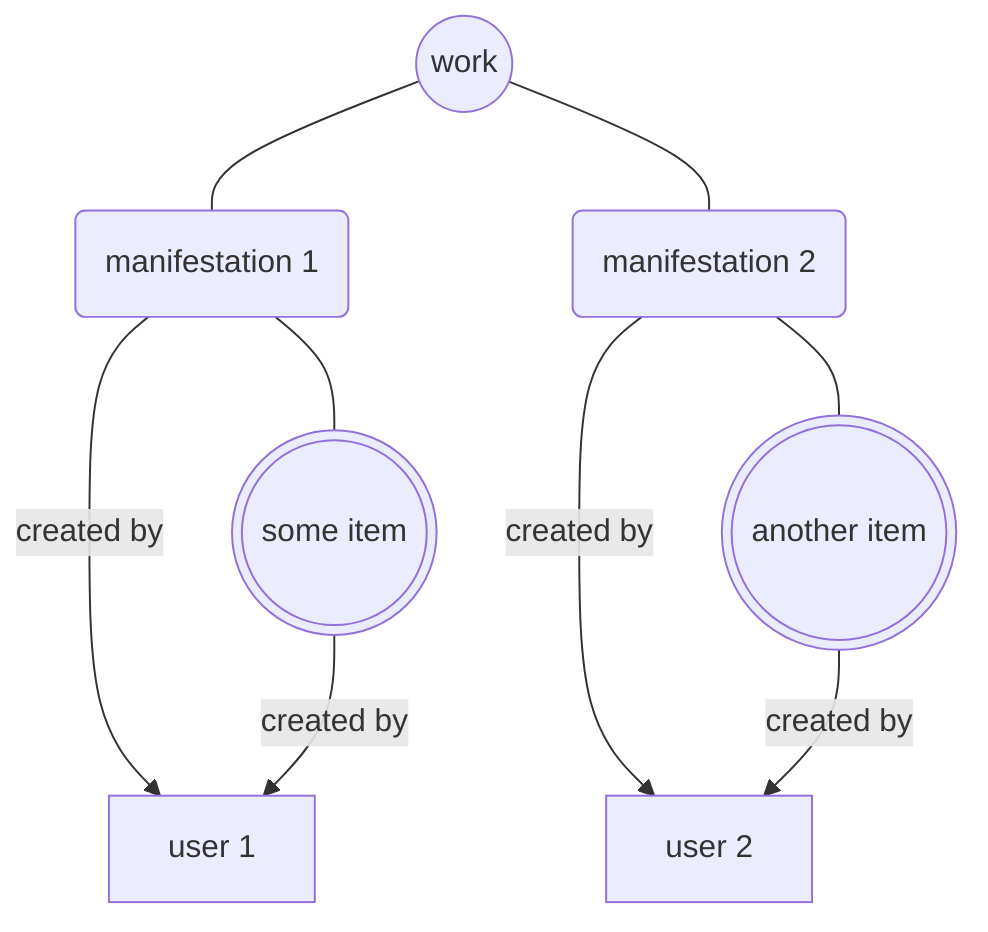
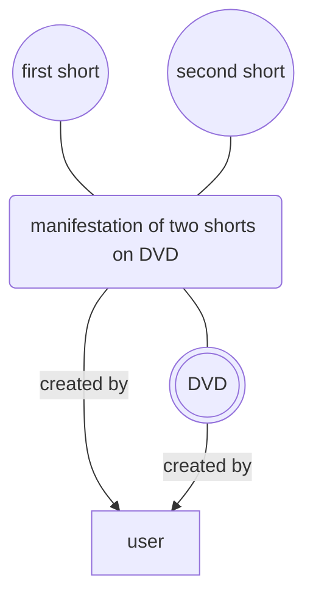

# Schema for Audio-Visual Material

The [AVefi project][] is all about persistent identifiers for
audio-visual material called efi Film Identifiers. The following efi
types are differentiated and have associated metadata as per the
[schema][AVefi schema repository]:

| efi type: | work | manifestation | item |
|---|---|---|---|
| **Definition:** | **[FIAF Cataloguing Manual][fiafmanual] section 1.0.1:**  A moving image Work comprises both the intellectual or artistic content and the process of realisation in a cinematographic medium, e.g., what it is called, when it was made, who made it, who was in it, what it is about, etc. A Work as a conceptual entity is the topmost level of description. [...] It is intended to function as the “node” that relates all Variants and Manifestations of a Work to a common creation. A Work contains the characteristics that are inherited across any Variant, Manifestation, or Item derived from that Work. [...] | **[FIAF Cataloguing Manual][fiafmanual] section 2.0:**  A moving image Manifestation is the embodiment of a moving image Work/Variant. [...] A Manifestation possesses common characteristics with respect to shared intellectual content and physical format, e.g., releases, broadcasts, etc. It may be whole or incomplete or a fragment. A Manifestation is not exclusively bound to a single Work/Variant, since it can be an aggregate for reasons connected to the publication, to the commercial release, or for mere convenience. A Manifestation can therefore be associated or linked to more than one Work/Variant. [...] | **[FIAF Cataloguing Manual][fiafmanual] section 3.0:**  A moving image Item is the physical or digital product of a Manifestation of a Work or Variant, i.e. the actual copy of a Work or Variant. Whereas the Manifestation record describes the “ideal” of a particular format or publication, the Item record represents the actual holding in a repository’s collection. An Item may consist of one or more components, i.e. the whole Item may consist of 1 reel or 5 reels, 2 VHS tapes or 1 DVD. [...] The Item may be whole or incomplete or a fragment. In the case of purely digital media, an Item is defined as the availability of the computer file, irrespective of the number of backup copies that may exist. |
| **Accept CREATE if user:** | is authenticated and provides metadata or efi for at least one accompanying manifestation and item. | is authenticated and provides metadata or efi for at least one accompanying item and work. | is authenticated and provides metadata or efi for at least one accompanying manifestation and work. |
| **Accept UPDATE if user:** | is authenticated and owns at least one manifestation associated with this work. | is authenticated and owns the manifestation. | is authenticated and owns the item. |

[AVefi project]: https://projects.tib.eu/av-efi/
[AVefi schema repository]: https://github.com/AV-efi/av-efi-schema/
[fiafmanual]: https://www.fiafnet.org/pages/E-Resources/Cataloguing-Manual.html

### Example 1: Two archives have registered efis for the same work

### Example 2: Archive has registered efis for a DVD of shorts

## Acknowledgements

The schema is reasonably well aligned with and heavily inspired by the
[FIAFcore ontology][]. Using [LinkML][] as a development framework, we
generate the documentation and other derivatives from the [AVefi
schema repository][].

[FIAFcore ontology]: https://fiafcore.org/
[LinkML]: https://linkml.io/
